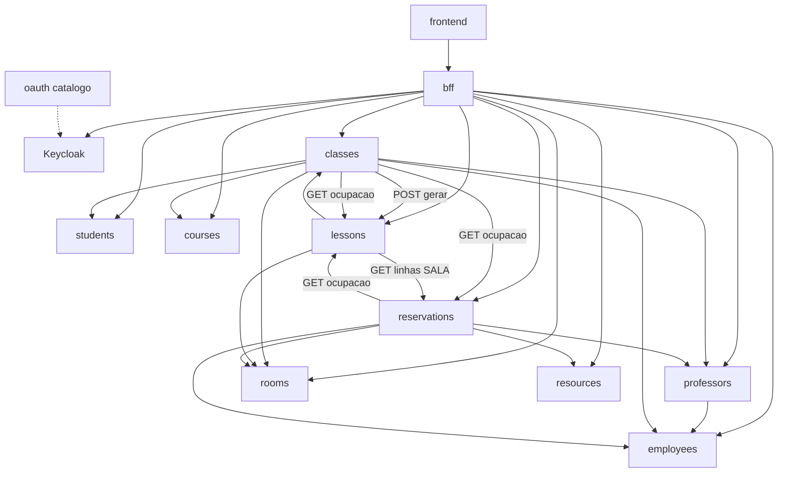
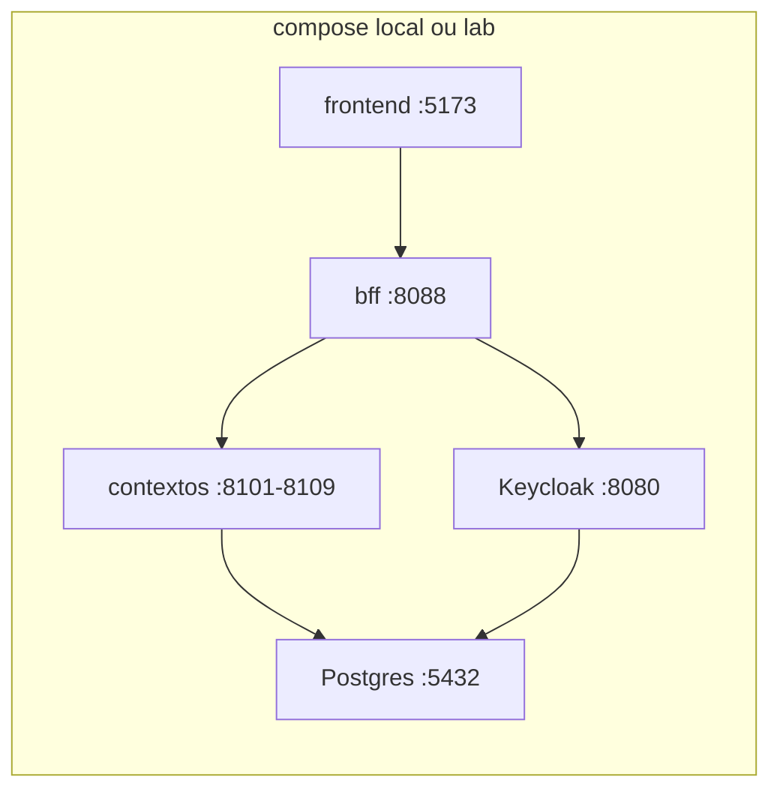
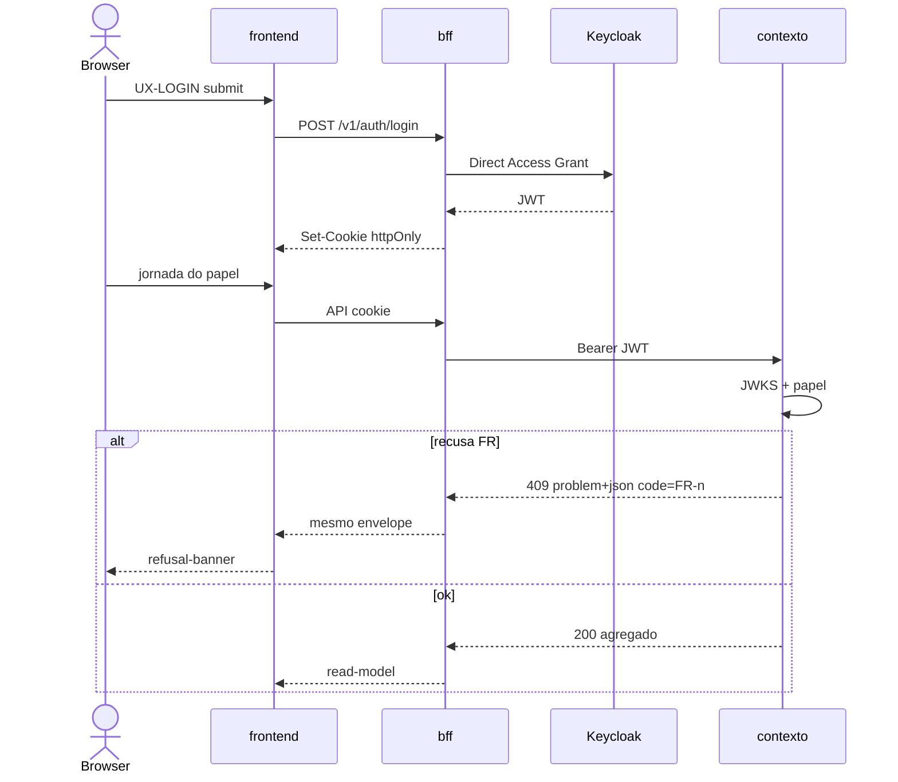

# Architecture Spine — Closed CRAS

Invariantes para nove grupos implementarem em paralelo sem divergir em contrato, identidade, BFF ou frontend. Glossário, UJs, telas e OQ-1 não se relitam aqui.

## Design Paradigm

**Malha de bounded contexts com BFF.** Cada contexto de domínio é unidade de contrato, de dados e de deploy. O BFF é a única composição voltada à UI. O módulo `oauth` não é um décimo domínio: é o catálogo do IdP e do gateway. A UI é **uma** SPA com acesso por papel — não quatro produtos, não uma SPA por papel, não um seletor de serviço.

| Camada | Onde | Pode | Não pode |
| --- | --- | --- | --- |
| IdP | Keycloak (submódulo `oauth`) | emitir JWT do realm `closed-cras` | ser chamado pelo browser |
| Contextos (9) | `backend/<contexto>` | persistir o próprio par 1–N; resource-server | copiar cadastro alheio; CORS de SPA |
| Catálogo oauth | `backend/oauth` | realm, faixas, papéis/escopos, fragmento OpenAPI, adapters de referência | dono exclusivo de grupo; biblioteca de uma só linguagem como único artefato |
| BFF | `backend/bff` | login de browser, cookie, join de leitura, rotas por módulo de contexto | ser dono de agregado; recalcular sala efetiva; vazar roster em reserva |
| UI | `frontend` | superfícies UX-*; tokens de `DESIGN.md` | join de nove OpenAPIs; adapter JS ao IdP |

## Invariants & Rules

### AD-1 — Direção de dependência da malha [ADOPTED]

- **Binds:** os 9 contextos, `bff`, `oauth`, `frontend`, NFR-CTR-1, NFR-CTR-2
- **Prevents:** UI falando com domínio; BFF persistindo agregado; `classes` copiando Room; ciclo de escrita `lessons` ↔ `reservations`
- **Rule:** setas abaixo são as únicas dependências de runtime permitidas. IDs alheios são atributos, não terceira classe. Escrita obedece NFR-CTR-2 (funcionário: Employee/Room/Resource/cria Professor; coordenador: Course/Class; professor: ajuste de Lesson e Reservation; Student só lê via BFF). A **única** criação em massa de Lesson é `POST /v1/lessons/gerar` chamado por `classes` após FR-13/FR-15 (AD-9); `lessons` persiste o agregado; professor só altera Lesson já existente. `classes` e `reservations` fazem GET em `employees` (campo `ativo`, OQ-2). `oauth` não é chamado como serviço de domínio. Ciclo `lessons` ↔ `reservations` só em GET, profundidade 1.



### AD-2 — Fio compartilhado: OpenAPI, IDs, data+faixa, recusa [ADOPTED]

- **Binds:** FR-25, FR-13, FR-15, FR-23, FR-24, FR-30, FR-4, FR-11, NFR-CTR-3, NFR-CTR-4, SM-5
- **Prevents:** `/funcionarios` vs `/employees`; `pessoa`/`evento`/`slot`; datetime solto; envelope ad hoc com campo `message`; UI decidindo colisão
- **Rule:** cada contexto publica OpenAPI 3.1 YAML como fonte da verdade em `openapi/openapi.yaml` (spec 3.2.0 existe; pin 3.1 porque springdoc 3.1.0 e tooling Nest geram 3.1). Paths: `/v1/...` com o nome inglês do submódulo (`/v1/employees`, `/v1/classes`). Propriedades JSON usam tokens do glossário (`employeeId`, `salaEfetivaId`, `faixaId`, `classId`, `lessonId`, `roomId`). IDs **emitidos** pelo Closed CRAS = UUID v4 (string). `Student.id` é string opaca do seed/import — não remintar (FR-7). `Course` tem `id` UUID **e** `codigo` alinhável (FR-10). `faixaId` = código do cânone A–E, F–N, P (sem O, E1, E2). `backend/oauth/contracts/faixas.json` replica a tabela do addendum (`codigo`, `inicio`, `fim`); depois de E vem F (almoço é lacuna, não faixa). WeeklySlot: dia seg–sáb. Não copiar a tabela para nove repos. O par data+faixa é dois campos (`data` = `YYYY-MM-DD`, `faixaId`); intervalo da faixa é fechado-aberto nos extremos. Lista JSON: propriedade `items` (array); sem paginação na v1. Recusas de invariante respondem `application/problem+json` (RFC 9457) com `code` = id do FR (`FR-13`, `FR-15`, `FR-23`, `FR-24`, …), `type` = `urn:closed-cras:recusa:<code>`, status 409 (422 só validação de forma). A UI mapeia `code` para `refusal-banner`; não reimplementa a regra.

### AD-3 — Invariante de stack vs paved path por contexto

- **Binds:** os 9 contextos, `bff`, `frontend`, `oauth`
- **Prevents:** BFF em duas linguagens; módulo `oauth` só como `.jar`; Spring Boot 3.5 (EOL 2026-06-30); Next.js/RSC competindo com o BFF
- **Rule:** o que é compartilhado está pinado na tabela Stack e não se troca por grupo: OpenAPI 3.1, HTTP/JSON, Keycloak, PostgreSQL, BFF NestJS, UI React+Vite. Cada um dos nove escolhe **um** paved path para o próprio serviço — Spring Boot 4.1.x **ou** NestJS 11.2.x (Express 5.2.x como runtime Nest) — desde que AD-2 e AD-4 passem. `oauth` entrega realm + fragmento OpenAPI do gateway + catálogo + adapters de referência nos dois paved paths; o adapter não substitui o contrato. `[ASSUMPTION]` BFF em NestJS (não Spring) porque a UI já é TypeScript e o BFF é composição, não agregado.

### AD-4 — Gateway REST de identidade `[ASSUMPTION]` fluxo de laboratório

- **Binds:** FR-27, UX-LOGIN, os 9 contextos, `bff`, `oauth`
- **Prevents:** adapter JS da UI ao Keycloak; nove endpoints de login; um grupo dono do IdP; token em `localStorage`; UI chamando o IdP (inclui `keycloak-js`, que ainda existe — é proibido aqui, não “deprecated”); adapter Node.js do Keycloak (DEPRECATED)
- **Rule:** o **gateway REST de identidade visível ao browser** é o BFF — é este o “gateway” da UX-LOGIN. `POST /v1/auth/login` usa Direct Access Grant do client confidencial `bff` no realm `closed-cras`. O BFF grava access/refresh em cookie httpOnly SameSite=Lax (`Access-Control-Allow-Credentials` só para a origem do frontend) e propaga `Authorization: Bearer` aos contextos. A UI não conhece URL do Keycloak. Cada um dos nove implementa **resource-server**: valida JWT via JWKS, declara papéis/escopos em `backend/oauth/contracts/roles-scopes.yaml` (PR de qualquer grupo; sem dono exclusivo) e expõe `GET /v1/identidade/me` com o **mesmo** schema do fragmento `backend/oauth/openapi/identity-gateway.yaml`: `sub`, `email`, `papeis`, `employeeId`, `professorId`, `studentId` (nulos se não aplicável). Claims do JWT (protocol mapper / atributos do user Keycloak): `email`, papéis de realm, e os três IDs opacos. Username do IdP = e-mail institucional. Papéis v1: `funcionario`, `coordenador`, `professor`, `student`. Credencial recusada: 401 sem enumerar se a conta existe. BFF/IdP indisponível: 503; UI mostra banner, sem fallback ao IdP. Federação CAFe/BAITA fora da v1. `[ASSUMPTION]` Direct Access Grant (não Authorization Code com redirect) para o `login-panel` recusar credencial no próprio banner.

### AD-5 — Sala efetiva em `lessons`; conflito no escritor

- **Binds:** FR-13, FR-16, FR-18, FR-19, FR-23, FR-24, FR-29, FR-30, UJ-2, UJ-4
- **Prevents:** BFF ou UI calculando sala efetiva; 18 reservas da sala padrão; `reservations` persistindo a derivação; ocupação só a partir de Reservation (omitiria a sala padrão); FR-13 recusando Recurso; dois módulos BFF donos de FR-29
- **Rule:** `lessons` é o único dono da derivação. Presencial sem linha SALA → `salaEfetivaId` = `Class.roomId`. Presencial com `ReservationLine.kind=SALA` daquela `lessonId` → `salaEfetivaId` = `targetId` e a sala padrão fica livre naquela data+faixa. Remoto → `salaEfetivaId` nulo **mesmo se** existir linha SALA; `lessons` não apaga Reservation (o professor cancela via FR-30). GET de Lesson e `GET /v1/lessons/ocupacao?data=&faixaId=` devolvem `salaEfetivaId` já resolvido e leem `rooms` por esse id. `GET /v1/lessons/ocupacao` inclui ainda `lessonId`, `professorIds`, `modalidade` — **sem** Resource. `GET /v1/reservations/ocupacao?data=&faixaId=` devolve `reservationId`, `professorId`, `lessonId` (ausente se ad hoc), `kind`, `targetId`. **Merge no escritor (UI não decide):** FR-13 usa union de salas (`lessons.salaEfetivaId` ∪ `reservations` kind=SALA) e union de professores (`lessons.professorIds` ∪ `reservations.professorId`); Recurso **não** entra; FR-15 à parte via GET `rooms` (capacidade ≥ vagas e ≥1 AccessibilityFeature). FR-23/24/30 usam o mesmo union de sala e professor **mais** Recurso tomado/inativo (só linhas RECURSO); no máximo uma linha SALA por `lessonId`; SALA exige capacidade/a11y da Room (ad hoc: capacidade > 0 e ≥1 feature). FR-29 (BFF, AD-6) une salas efetivas + SALA ad hoc + RECURSO; nunca `studentIds`.

### AD-6 — Browser só no BFF; LGPD nas rotas de composição [ADOPTED]

- **Binds:** FR-19, FR-26, FR-29, FR-31, NFR-LGPD-1, NFR-LGPD-2, NFR-LGPD-3, NFR-LGPD-4, UX-S7, UX-S8, UX-S9
- **Prevents:** join de nove OpenAPIs no browser; CORS de SPA nos contextos; roster em Reservation; dois donos BFF de FR-29/FR-19
- **Rule:** só o BFF habilita CORS (origem do `frontend`, credentials). Contextos recusam `Origin` de browser. Contrato público do BFF: `backend/bff/openapi/openapi.yaml` (OpenAPI 3.1, mesmos envelope e `items` do AD-2). Cada grupo adiciona **o próprio** domínio em `backend/bff/src/modules/<contexto>/` (sem dono exclusivo). FR-29 vive **somente** em `backend/bff/src/modules/ocupacao/` (módulo compartilhado, como auth). FR-19 (Student) vive **somente** no módulo `lessons` do BFF. Módulo `reservations` do BFF **não** inclui `Class.studentIds`. Roster só no módulo `classes` (UX-S8 / FR-31) e só da Class atribuída ao Professor autenticado. Sem campo CPF na v1. NFR-LGPD-4: não apagar `id` canônico para “limpar tela”. Read-models consomem AD-5; não recalculam sala efetiva.

### AD-7 — Envelope operacional de laboratório [ADOPTED]

- **Binds:** NFR-Q-1, NFR-Q-2, demo ConstrSW
- **Prevents:** Kubernetes de produção; um schema SQL compartilhado entre contextos; IdP SaaS; sensores no caminho crítico
- **Rule:** um Docker Compose na raiz da malha (`docker compose`, plugin v2) sobe Keycloak `start-dev`, um PostgreSQL 18.6 com **um database por contexto** (`cras_<contexto>`), os nove serviços, BFF e frontend. Imagem `postgres:18.6` (volume do major 18; não reusar path de dados do 17). Ambiente `local` = compose na máquina do aluno; `lab` = o mesmo compose numa VM da disciplina. Sem cluster, sem Helm. `GET /health` anônimo em BFF e contextos. Logs em stdout. Ocupação v1 é **agendada** (FR-29), não sensor.

### AD-8 — UI web única e tokens visuais [ADOPTED]

- **Binds:** FR-28, UX-LOGIN, UX-HOME, UX-S1–UX-S9, `DESIGN.md`, `EXPERIENCE.md`
- **Prevents:** quatro SPAs; uma SPA por papel; MUI/Ant/Chakra com tema próprio; tokens relitigados; tela de alta de Student; seletor de microsserviço; grupo implementando a tela do próprio contexto
- **Rule:** um app Vite SPA (sem SSR/RSC). `src/shell` = UX-LOGIN, UX-HOME, `app-shell` e `role-nav` em **todas** as rotas autenticadas. Superfícies exclusivas: `src/surfaces/ux-s1` … `ux-s9` (no máximo um grupo por UX-S*). O grupo **não** implementa as telas do próprio contexto (FR-28); o emparelhamento cruzado é OQ-1. Sessão ausente/expirada ou logout → UX-LOGIN. URL de outro papel → UX-HOME do papel atual (sem nome de serviço). Credencial recusada: banner no `login-panel`, sem enumerar conta. BFF/IdP down: banner, sem adapter. Dados só via TanStack Query → BFF. `src/theme/tokens.css` reproduz `DESIGN.md` (primary `#1E3A5F`; accent `#C45C26` só sala efetiva divergente; IBM Plex Sans/Mono; v1 light-only). Kit de componentes com paleta própria é defeito. Até OQ-3 fechar, LessonTopic na API e na UX-S7 exige pelo menos um de `syllabusItemId` ou enunciado extra. `[ASSUMPTION]` React (não Vue/Angular) no starter oficial Vite `react-ts`.

### AD-9 — Geração de Lesson e imutabilidade da data+faixa

- **Binds:** FR-13, FR-14, FR-16, `classes`, `lessons`
- **Prevents:** `classes` e `lessons` cada um inventando o POST de criação; regenerar esqueleto; editar data+faixa da Lesson na v1
- **Rule:** depois de FR-13 e FR-15 confirmados, só `classes` chama `POST /v1/lessons/gerar` com `classId`. `lessons` cria uma Lesson por par (dia, faixa) no intervalo início/fim da Class (WeeklySlot seg–sáb; feriados **não** excluídos na v1). `data` e `faixaId` da Lesson são imutáveis. Não há editar esqueleto nem regenerar. Correção de oferta = nova Class (non-goal do PRD). Professor não cria Class nem dispara gerar.

## Consistency Conventions

| Concern | Convention |
| --- | --- |
| Naming | Submódulo e path = inglês do contexto. JSON e UI = tokens do glossário. OpenAPI `info.title` = nome do contexto. |
| Data & formats | UUID v4 só para ID emitido; Student.id opaco; Course.codigo além do id; `data` date-only; `faixaId` cânone; lista com `items`; RFC 9457; JSON camelCase; UTF-8 |
| State & cross-cutting | Mutação no contexto dono; BFF sem persistência de agregado; JWT Bearer serviço-a-serviço (token do usuário); sem barramento de eventos na v1; config por env (`DATABASE_URL`, `KEYCLOAK_JWKS_URL`, `BFF_ORIGIN`) |
| AuthZ | Quatro papéis de realm; gateway de cada contexto recusa escrita fora de NFR-CTR-2; Student sem rota de escrita |
| Equidade | Uma principal + uma secundária 1–N (Employee/EmploymentBond, Professor/AcademicDegree, Student/AcademicAffiliation, Course/SyllabusItem, Room/AccessibilityFeature, Resource/InventoryItem, Class/WeeklySlot, Lesson/LessonTopic, Reservation/ReservationLine). IDs alheios = atributos. Professor não copia nome/e-mail. Todo Professor é Employee; nem todo Employee é Professor. EmploymentBond não é SIGRH. |
| Student | Seed/import JSON idempotente por `id` em `students`; sem tela de alta |
| OQ-2 | Employee desativado: Class somente leitura; nova Reservation recusada; sem exigência de substituição. Escritores consultam `employees.ativo`. |
| OQ-3 (default até fechar) | LessonTopic: pelo menos um de `syllabusItemId` ou enunciado extra |
| LGPD | Cadastro administrativo em escopo (não se esconder no art. 4º); sem CPF v1; não apagar id canônico |

## Stack

Verificado na web em 2026-08-24. Código passa a ser o dono depois do cold-start. OpenAPI 3.2.0 é o spec vigente; contratos pinam 3.1 por springdoc/Nest. TypeScript 6.0.2 (não 7.0.x): Nest CLI 11 e o starter Vite `react-ts` não cabem no 7.

| Name | Version |
| --- | --- |
| OpenAPI Specification (contratos) | 3.1 |
| Java (paved path Spring) | 21 |
| Spring Boot | 4.1.1 |
| springdoc-openapi | 3.1.0 |
| Node.js | 24.19.0 |
| NestJS (`@nestjs/core`, BFF e paved path Node) | 11.2.1 |
| Express | 5.2.1 |
| TypeScript | 6.0.2 |
| Keycloak | 26.7.2 |
| Keycloak image | quay.io/keycloak/keycloak:26.7.2 |
| PostgreSQL | 18.6 |
| React | 19.2.8 |
| React DOM | 19.2.8 |
| Vite | 8.2.2 |
| @vitejs/plugin-react | 6.1.0 |
| react-router | 8.3.0 |
| @tanstack/react-query | 5.102.3 |
| @fontsource/ibm-plex-sans | 5.3.0 |
| @fontsource/ibm-plex-mono | 5.3.0 |
| Docker Compose | v2 |

## Structural Seed

```text
constrsw-2026-2/                  # malha (este repo); compose.yaml na raiz
  backend/oauth/                  # realm, faixas.json, roles-scopes.yaml, openapi/identity-gateway.yaml, adapters/spring, adapters/nestjs
  backend/employees/              # um git repo por contexto (submódulo, não pasta de monorepo)
  backend/professors/
  backend/students/
  backend/courses/
  backend/rooms/
  backend/resources/
  backend/classes/
  backend/lessons/
  backend/reservations/
  backend/bff/                    # NestJS; src/modules/<contexto>/ por grupo; src/modules/ocupacao/; src/modules/auth/
  frontend/                       # Vite SPA
    src/shell/                    # UX-LOGIN, UX-HOME, app-shell, role-nav
    src/surfaces/ux-s1 … ux-s9/
    src/theme/tokens.css
```

Portas seed do compose (host):

| Unidade | Porta |
| --- | --- |
| Keycloak | 8080 |
| PostgreSQL | 5432 |
| employees | 8101 |
| professors | 8102 |
| students | 8103 |
| courses | 8104 |
| rooms | 8105 |
| resources | 8106 |
| classes | 8107 |
| lessons | 8108 |
| reservations | 8109 |
| BFF | 8088 |
| frontend | 5173 |





## Capability → Architecture Map

| Capability / Area | Lives in | Governed by |
| --- | --- | --- |
| FR-1, FR-2 Employee + EmploymentBond | `employees` + BFF módulo + UX-S1 | AD-1, AD-2, AD-6 |
| FR-3, NFR-ID-1/2 identidade não copiada | todos os consumidores guardam IDs | AD-1, AD-2 |
| FR-4, FR-5, FR-6 Professor is-a + AcademicDegree | `professors` (exige `employeeId`) + UX-S2 | AD-1, AD-4 |
| FR-7, FR-8, FR-9 Student seed + affiliation; roster em Class | `students` import; `classes.studentIds` | AD-1, AD-8, convenção Student |
| FR-10, FR-11, FR-12 Course + plano + SyllabusItem | `courses` + UX-S5 | AD-1, AD-2 |
| FR-13, FR-14, FR-15 abrir Class + esqueleto + capacidade/a11y | `classes` escreve; GET ocupacao lessons+reservations; GET rooms | AD-5, AD-2, AD-9 |
| FR-16 gerar Lesson | `POST /v1/lessons/gerar` só via `classes` | AD-9 |
| FR-17, FR-18, OQ-3 Lesson + sala efetiva | `lessons` dono da derivação; lê `rooms` | AD-5, AD-8 default OQ-3 |
| FR-19 Student onde/quê/avaliação | BFF módulo `lessons` → UX-S9 | AD-5, AD-6 |
| FR-20, FR-21 Room + AccessibilityFeature | `rooms` + UX-S3 zona Room | AD-1 |
| FR-22 Resource + InventoryItem | `resources` + UX-S3 zona Resource | AD-1 |
| FR-23, FR-24, FR-30 Reservation +/- cancelar | `reservations`; merge AD-5 | AD-5, AD-2 |
| FR-25 contract-first | `openapi/openapi.yaml` de cada contexto | AD-2, AD-3 |
| FR-26, FR-29 ocupação data+faixa | BFF `modules/ocupacao` → UX-S4 | AD-5, AD-6 |
| FR-27 gateway identidade | BFF = gateway do browser; resource-server nos 9 | AD-4 |
| FR-28 frontend cruzado | `frontend` superfícies; não o próprio domínio; OQ-1 donos | AD-8 |
| FR-31 plano + roster | BFF módulo `classes` → UX-S8 (não S7); Class atribuída | AD-6 |
| NFR-LGPD-1–4 | BFF recortes + sem CPF v1 | AD-6, AD-2 |
| NFR-CTR-1–4 | direção AD-1; faixas AD-2 | AD-1, AD-2 |
| NFR-Q-1, NFR-Q-2 formato e ocupação agendada | compose; sem sensor | AD-7, AD-8 |
| UX-LOGIN, UX-HOME | `frontend/src/shell` + BFF `/v1/auth` | AD-4, AD-8 |
| UX-S1–UX-S9 | `frontend/src/surfaces`; OQ-1 | AD-8 |

## Deferred

- **OQ-1** emparelhamento grupo ↔ UX-S1…S9 — turma/docente; a spine não atribui donos. A regra “não o próprio domínio” já vale (AD-8).
- **OQ-3** enunciado vs `syllabusItemId` obrigatório — grupo `lessons`. Default de demo na AD-8 até fechar.
- Arquitetura interna de cada serviço (hexagonal vs layered, ORM).
- Codegen OpenAPI (orval, openapi-generator) — o YAML é a invariante.
- Barramento de eventos, saga, ocupação real/no-show, OneRoster/Edu-API.
- Authorization Code + PKCE e federação CAFe/BAITA.
- Escopos finos além dos quatro papéis de realm.
- Kubernetes, service mesh, observabilidade de cluster.
- Biblioteca de componentes com tema próprio (proibida, não escolhida depois).
- Java 25 LTS (permitido no range do Boot 4.1; pin da malha permanece 21).
