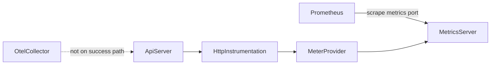
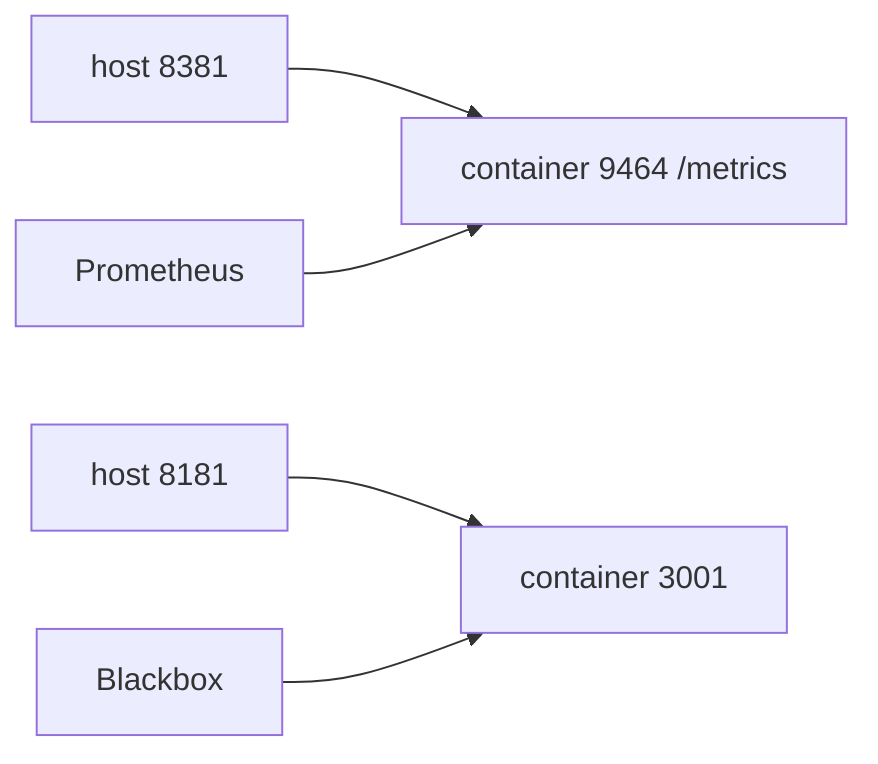

# Architecture Spine — oauth Prometheus pull

## Design Paradigm

In-process OpenTelemetry SDK with a Prometheus pull exporter. The oauth process records HTTP metrics and exposes them as Prometheus text. Prometheus scrapes that text. The OpenTelemetry collector is not on this path.

## Invariants & Rules



### AD-1 — Prometheus pull only

- **Binds:** all oauth telemetry
- **Prevents:** a push-only OTLP path, or a second metrics library beside the OpenTelemetry SDK
- **Rule:** Metrics leave the process only when a scraper reads `/metrics`. Do not configure an OTLP trace, metric, or log exporter. The resource attribute `service.name` is `oauth`. [ADOPTED]

### AD-2 — Dedicated metrics listener

- **Binds:** the metrics listener
- **Prevents:** binding the metrics server to loopback, or serving `/metrics` on the API port
- **Rule:** Bind `0.0.0.0` to `OAUTH_INTERNAL_METRICS_PORT` (professor value 9464) and serve Prometheus text at `/metrics`. The Prometheus exporter is the only listener on that port. Do not invent an environment variable name and do not add a Nest route or a second HTTP server on it. [ADOPTED]

### AD-3 — SDK starts before the HTTP server

- **Binds:** process bootstrap
- **Prevents:** creating the Nest application before HTTP instrumentation is registered, or starting a second meter provider
- **Rule:** Start one OpenTelemetry SDK before `NestFactory.create`. The API server then listens on `OAUTH_INTERNAL_API_PORT` as it does today. [ADOPTED]

### AD-4 — HTTP instrumentation only

- **Binds:** which signals are produced
- **Prevents:** loading `@opentelemetry/auto-instrumentations-node`, or exporting traces
- **Rule:** Use `@opentelemetry/instrumentation-http` as the only instrumentation. The SDK metric reader is the Prometheus exporter. [ADOPTED]

### AD-5 — Scrape hostname is oauth

- **Binds:** professor `prometheus.yml` scrape of this service
- **Prevents:** leaving the job named or targeted at `auth`, or editing unrelated jobs, compose, or `.env`
- **Rule:** In the NestJS scrape job only, set `job_name` to `oauth`, set the target to `oauth:9464`, keep path `/metrics`, and name oauth in that job's comment. In the blackbox job, change only `http://auth:3001/health` to `http://oauth:3001/health`. Edit no other job, and do not edit compose or `.env`. [ADOPTED]

### AD-6 — Credentials stay out of metrics

- **Binds:** every metric attribute
- **Prevents:** access tokens, refresh tokens, passwords, client secrets, or the Authorization header becoming labels or sample values
- **Rule:** Do not attach those fields as metric attributes. Do not log a metrics scrape body that contains them. [ADOPTED]

### AD-7 — T1 HTTP contracts stay

- **Binds:** login, users, roles, authz, the OA error body, and `GET /health`
- **Prevents:** changing status codes or response bodies so metrics are easier to collect
- **Rule:** `GET /health` still returns a body whose status is ok. The compose healthcheck still calls the API port, not the metrics port. [ADOPTED]

## Consistency Conventions

| Concern | Convention |
| --- | --- |
| Naming | Resource `service.name` and the retargeted Prometheus `job_name` are both `oauth`, per AD-1 and AD-5. |
| Data and formats | Metrics exposition is Prometheus text. API errors stay the OA envelope. Health body stays status ok. |
| State and cross-cutting | One SDK per process. Metrics port comes from `OAUTH_INTERNAL_METRICS_PORT`. API port comes from `OAUTH_INTERNAL_API_PORT`. No credential attributes. |
| Deployment | Same compose service `oauth`. No new service. Host port `8381` already maps to container port `9464`. In-network scrape uses `oauth:9464`. |

## Stack

| Name | Version |
| --- | --- |
| Node.js | 22 |
| NestJS | 11 |
| @opentelemetry/api | 1.9.1 |
| @opentelemetry/sdk-node | 0.221.0 |
| @opentelemetry/exporter-prometheus | 0.221.0 |
| @opentelemetry/instrumentation-http | 0.221.0 |

`@opentelemetry/exporter-prometheus` and `@opentelemetry/sdk-node` must stay at 0.217.0 or newer (CVE-2026-44902). The pin above is the matching 0.221.0 line verified on npm on 2026-09-21.

## Structural Seed

```text
backend/oauth/
  src/main.ts                 # start SDK, then NestFactory.create, then listen on API port
  src/telemetry/              # SDK setup only; HTTP handlers stay in existing modules
infrastructure/dev.local/services/prometheus/prometheus.yml
```



Prometheus storage stays the external volume `constrsw-prometheus-data`. Create that volume before compose up. Oauth does not write that volume.

## Capability to Architecture Map

| Capability / Area | Lives in | Governed by |
| --- | --- | --- |
| CAP-1 Prometheus text on the metrics port | metrics listener in the oauth process | AD-1, AD-2 |
| CAP-2 HTTP call increments an HTTP server metric | HTTP instrumentation on the API server | AD-3, AD-4 |
| CAP-3 Secrets absent from metric labels | attribute policy on that instrumentation | AD-6 |
| CAP-4 T1 login and health unchanged | existing controllers | AD-7 |
| Scrape target up in Prometheus | parent `prometheus.yml` job `oauth` | AD-5 |

## Deferred

- OTLP export to `otel-collector`. The collector debug-prints traces and logs and is not the success path.
- Grafana, alert rule edits, and recording-rule edits.
- Business counters beyond what HTTP instrumentation already emits.
- Histogram bucket overrides and exemplar config.
- Instrumenting any service other than oauth.
- The exact Prometheus series name inside the `http_server_request_duration` or `http_server_duration` family. A test accepts either prefix.
