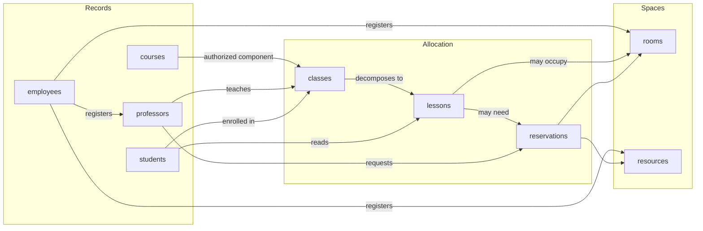

# Research Report: domain

**Date:** 2026-08-17
**Author:** EduardoArruda
**Research Type:** domain

---

## Research Overview

This document is a domain research report on **university academic and resource management**, written to inform a ConstrSW PRD. Scope is nine bounded contexts (`classes`, `lessons`, `reservations`, `students`, `courses`, `resources`, `professors`, `rooms`, `employees`) and four personas (staff, course coordinators, professors, students).

The load-bearing finding is a split the industry already lives with: **records** (people, courses) versus **allocation** (turmas, aulas, salas, recursos, reservas). Regulation in Brazil (e-MEC, Census, LGPD, digital acervo, NBR 9050) constrains identities and documents; it does not require a monolith. Commercial suites collapse contexts; scheduling specialists integrate. This solution should look like the specialist: contract-first APIs, one identity owner per person type, OIDC.

Detailed evidence sits in the sections below. The **Research Synthesis** (end of this file) holds the executive summary, ubiquitous-language map, context interactions, and PRD recommendations.

---

## Domain Research Scope Confirmation

**Research Topic:** University academic and resource management
**Research Goals:** Map ubiquitous language, responsibilities, and cross-context interactions among nine bounded contexts (classes, lessons, reservations, students, courses, resources, professors, rooms, employees) as operated by university staff, course coordinators, professors, and students, to inform the PRD.

**Domain Research Scope:**

- Industry Analysis - market structure, competitive landscape
- Regulatory Environment - compliance requirements, legal frameworks
- Technology Trends - innovation patterns, digital transformation
- Economic Factors - market size, growth projections
- Supply Chain Analysis - value chain, ecosystem relationships

**Research Methodology:**

- All claims verified against current public sources
- Multi-source validation for critical domain claims
- Confidence level framework for uncertain information
- Comprehensive domain coverage with industry-specific insights

**Scope Confirmed:** 2026-08-17

---

## Industry Analysis

_Confidence note: published TAM figures for this domain disagree by 2–8× depending on whether the analyst counts K-12+HE SIS, HE-only SIS, HE ERP suites, campus management, or dedicated timetable/room-booking tools. Figures below are tagged with scope and confidence. None of these reports is a primary census; treat them as order-of-magnitude signals, not budget inputs._

### Market Size and Valuation

University academic and resource management sits inside a stack of adjacent software markets, not a single product category.

| Scope | Size (stated year) | Horizon | Source |
|---|---|---|---|
| Global Student Information Systems (K-12 + HE) | USD 8.36B (2026) | USD 15.36B by 2031, CAGR 12.9% | [MarketsandMarkets](https://www.marketsandmarkets.com/Market-Reports/student-information-system-market-21151415.html) |
| Global SIS (K-12 + HE) | USD 17.7B (2026) | USD 34.97B by 2031, CAGR 14.62% | [Mordor Intelligence](https://www.mordorintelligence.com/industry-reports/student-information-system-market) |
| SIS for Higher Education only | USD 4.25B (2025) | USD 12.8B by 2034, CAGR 11.6% | [Verified Market Reports](https://www.verifiedmarketreports.com/product/sis-for-higher-education-market/) |
| Higher Education ERP | USD 8.7B (2025) | USD 15.8B by 2035, CAGR 6.1% | [WiseGuyReports](https://www.wiseguyreports.com/reports/higher-education-erp-system-market) |
| Higher Education ERP | USD 10.8B (2024) | USD 31.6B by 2033, CAGR 12.7% | [Growth Market Reports](https://www.growthmarketreports.com/report/higher-education-erp-market) |
| Academic scheduling (narrow) | USD 2.18B (2025) | USD 4.12B by 2035, CAGR 6.57% | [Market Research Future](https://www.marketresearchfuture.com/reports/academic-scheduling-software-market-26589) |
| Course scheduling / academic planning | USD 2.26B (2025) | USD 6.5B by 2035, CAGR 11.1% | [WiseGuyReports](https://www.wiseguyreports.com/reports/course-scheduling-and-academic-planning-software-market) |
| Academic scheduling (alternate) | USD 1.8B (2025) | USD 4.1B by 2034, CAGR 9.6% | [Dataintelo](https://dataintelo.com/report/academic-scheduling-software-market) |
| Academic scheduling (broad, likely over-scoped) | USD 14.2B (2025) | USD 51.3B by 2035, CAGR 13.7% | [Future Market Insights](https://www.futuremarketinsights.com/reports/academic-scheduling-software-market) |
| Campus management software | USD 8.3B (2025) | USD 15.2B by 2034, CAGR 8.6% | [Dataintelo](https://dataintelo.com/report/campus-management-software-market) |

_Total Market Size: For the nine bounded contexts in this research, the economically relevant envelope is HE SIS (~USD 4–8B) plus academic scheduling/room booking (~USD 0.4–2.3B on conservative estimates) plus the facilities/resource slice of campus management. Confidence: **medium** on direction, **low** on any single headline number._

_Growth Rate: Mid-to-high single digits through low teens CAGR through the early 2030s, depending on category. SIS/HE ERP cluster around **11–15%** in several reports; dedicated scheduling is slower in some series (**~6.5%**) and faster in others (**~11%**)._

_Market Segments: Higher education held **58.20%** of global SIS revenue in 2025 (Mordor), which matches this project's university scope. Cloud deployment is the majority/fastest path in scheduling (FMI **57.8%** cloud share in 2025; Dataintelo **58.2%**)._

_Economic Impact: Value is created by (1) replacing paper/spreadsheet timetables, (2) raising real occupancy of expensive teaching space, (3) cutting double-booking and no-show waste on rooms and lab resources, and (4) satisfying regulatory reporting. McGill found that anecdotal “no small rooms” claims hid **~50% idle small classrooms** once booking data was visible — a utilization, not a construction, problem. Source: [EDUCAUSE Review, 2025](https://er.educause.edu/articles/2025/10/2026-educause-top-10-10-decision-maker-data-skills-and-literacy)._

### Market Dynamics and Growth

_Growth Drivers:_
- Cloud-first mandates and demand for a unified student/academic data ecosystem (Mordor).
- Hybrid/blended timetables after COVID, which widened the gap between **scheduled** occupancy and **actual** occupancy ([UC Today](https://www.uctoday.com/unified-communications/ai-space-optimization-in-education-cutting-costs-and-enhancing-campus-experience/)).
- AI for conflict detection, predictive capacity, and (emerging) agentic room booking ([Accruent](https://www.accruent.com/resources/blog-posts/agentic-ai-and-mobile-first-booking); [Spaces4Learning, Jan 2026](https://spaces4learning.com/articles/2026/01/22/3-trends-for-higher-education-to-stay-ahead-of-in-2026.aspx)).
- Private-equity conviction: Bain Capital acquired PowerSchool for **USD 5.6B**; KKR acquired Instructure for **USD 4.8B** (Mordor, citing company announcements).
- In Brazil, regulatory and diploma-digital/CENSO/ENADE obligations pull IES toward suites that already encode MEC processes ([Lyceum](https://www.lyceum.com.br/); [TOTVS Educacional](https://www.totvs.com/educacional/)).

_Growth Barriers:_
- Switching cost of the system of record (transcripts, curricula, historical enrollments).
- Organizational silos: registrar/timetabling vs facilities vs IT vs academic departments own different slices of “room + class + resource” ([EDUCAUSE 2024 learning-space analytics](https://events.educause.edu/annual-conference/2024/agenda/from-silos-to-insights-leveraging-learning-space-analytics-1); [NACUBO PBAF24](https://learn.nacubo.org/products/pbaf24-reimagining-instructional-space-utilization-to-align-resource-allocation-and-demand)).
- Interoperability failure in public Brazilian rollouts of SIG/SIGAA (customization, training, system compatibility) — [UnB dissertation, 2024/25](https://repositorio.unb.br/bitstream/10482/53005/1/EduardoChagasLustoza_DISSERT.pdf); UnB SIG implantation still multi-year as of the [Feb 2025 report](https://portalsig.unb.br/wp-content/uploads/2025/02/Terceiro_Relatorio_de_Implantacao_dos_Sistemas_Integrados_de_Gestao_na_UnB.pdf).
- Budget cuts vs student/faculty expectation of mobile self-service booking (Accruent).

_Cyclical Patterns:_ Strongly **academic-calendar cyclical**. Peak load is curriculum/timetable construction and enrollment before each term; in-term load is lesson delivery, resource reservation, and student lookup of “where is my class / what is assessed today.” Facilities master-data (rooms, resources, employees) is steadier.

_Market Maturity:_ **Mature core, transforming edge.** SIS/academic records are a decades-old system of record. Scheduling, space analytics, and resource booking are still often spreadsheet-or-siloed and are the growth/innovation layer. Confidence: **high** on this qualitative split.

### Market Structure and Segmentation

_Primary Segments (mapped to this project's bounded contexts):_

| Industry segment | Typical capabilities | Bounded contexts here |
|---|---|---|
| SIS / academic records | Students, enrollment, transcripts, courses, faculty of record | `students`, `courses`, `professors` |
| Curriculum / academic planning | Programs, course plans, bibliography, assessment design | `courses` (coordinator persona) |
| Timetabling / class scheduling | Sections, meetings, faculty assignment, conflict rules | `classes`, `lessons` |
| Room & event scheduling | Inventory, booking, utilization | `rooms`, `reservations` |
| Resource / lab booking | Equipment, loans, no-show reclaim | `resources`, `reservations` |
| Campus / HR / staff master data | Buildings, rooms, employees | `rooms`, `employees`, `professors` |
| LMS (adjacent, out of current scope) | Content delivery, virtual classroom | touches `lessons` / student portal |

Higher-education software reports typically split by **SIS, LMS, campus management, course management** ([WiseGuy HE software](https://www.wiseguyreports.com/reports/higher-education-software-market); [MarketResearch.biz](https://marketresearch.biz/report/higher-education-solutions-market/)). That product split **does not** match DDD bounded contexts one-to-one: commercial suites collapse several of our nine contexts into one monolith; the domain still has distinct owners (staff vs coordinator vs professor vs student).

_Sub-segment Analysis:_
- **Cloud vs on-prem vs hybrid** — cloud is the growth path; large IES keep hybrid because of identity, records retention, and local customization.
- **Public vs private IES (Brazil)** — public federal network often standardizes on UFRN **SIG** family (SIGAA academic, SIPAC admin, SIGRH HR). UFBA announced SIGAA for undergraduate processes in 2025, replacing SIAC ([UFBA](https://ufba.br/ufba_em_pauta/novo-sistema-para-gestao-de-atividades-academicas-na-graduacao-sera-implantado-pela)). Private IES more often buy **TOTVS Educacional** (claims 12 of 20 top private universities by IGC 20/21) or **Lyceum/Techne** (200+ institutions, 2M+ users) ([TOTVS](https://www.totvs.com/educacional/); [Lyceum](https://www.lyceum.com.br/)).
- **K-12 vs HE** — K-12 is the faster SIS CAGR (Mordor **16.8%**), but HE remains the revenue majority and the relevant segment here.

_Geographic Distribution:_ North America is the largest SIS market; Asia-Pacific the fastest (Mordor). Latin America appears as a growth geography in campus/scheduling series (Dataintelo LatAm scheduling CAGR **10.8%**). Brazil is a **distinct product ecosystem**, not a thin clone of Ellucian/Workday.

_Vertical Integration:_ Two patterns coexist:
1. **Suite** — one vendor owns student + academic + finance + HR (Ellucian, Workday, Oracle, TOTVS, SIG).
2. **Best-of-breed + integration** — SIS of record + Ad Astra / CollegeNET 25Live (1,000+ campuses, Emergen) + LMS + identity. This project's microservice split (nine services + BFF + OAuth) is architecturally closer to (2), while the **domain language** must still look like (1) to the four personas.

### Industry Trends and Evolution

_Emerging Trends:_
- From static timetable to **real-time space optimization** (sensors, Wi-Fi occupancy, no-show auto-release) — [UC Today](https://www.uctoday.com/unified-communications/ai-space-optimization-in-education-cutting-costs-and-enhancing-campus-experience/); [Spaces4Learning 2026](https://spaces4learning.com/articles/2026/01/22/3-trends-for-higher-education-to-stay-ahead-of-in-2026.aspx).
- **Mobile-first self-service** booking for faculty and students (Accruent).
- **Digital twins** for adaptive course timetabling (hard constraints: capacity, conflicts, travel; soft: preferences) — [arXiv:2503.06109](https://arxiv.org/html/2503.06109v1).
- Data literacy as an institutional bottleneck: utilization truth is knowable, but registrars and faculty still run on anecdote ([EDUCAUSE Review 2025](https://er.educause.edu/articles/2025/10/2026-educause-top-10-10-decision-maker-data-skills-and-literacy)).

_Historical Evolution:_ Paper ledgers → departmental databases → campus SIS/ERP → cloud suites → (now) analytics/AI overlay on booking and space. Brazil public sector is still mid-migration onto SIGAA (UnB from 2017, UFBA 2025).

_Technology Integration:_ API-first SIS, identity (OAuth/OIDC), LMS connectors (TOTVS cites Moodle), diploma digital / ICP-Brasil, CENSO/ENADE extracts. Research-stage digital twins remain **ahead** of typical IES production stacks. Confidence: **high** on API+identity+LMS; **low** on campus-wide digital twins in 2026 production.

_Future Outlook:_ The differentiator is not “another student table.” It is **consistent language and ownership** across class, lesson, room, resource, and reservation so that: staff master-data is trusted; coordinators publish course plans; professors allocate content and reserve resources onto lessons; students read location, content, and assessment without reconciling four systems.

### Competitive Dynamics

_Market Concentration:_ **Medium** globally (Mordor). SIS/ERP is an oligopoly of large platforms (Ellucian, Oracle, Workday, Anthology, PowerSchool) plus regional specialists. Scheduling/space is less concentrated (CollegeNET, Ad Astra, Accruent/Robin, plus SIS modules). Brazil is a **separate oligopoly**: SIG (public), TOTVS, Lyceum, plus local SIS.

_Competitive Intensity:_ High for new digital-experience layers (portals, booking UX, analytics); low for replacing the academic system of record. PE roll-ups (PowerSchool, Instructure) increase wallet-share pressure.

_Barriers to Entry:_ Data gravity of academic history; MEC/INEP reporting; multi-year implementations (UnB SIG still incomplete years after 2017 start); need for all four personas to adopt the same terms (`turma` ≠ `aula` ≠ `disciplina` ≠ `reserva`).

_Innovation Pressure:_ Strongest on scheduling, utilization, and self-service; weakest on core person/course master data. That is exactly the seam this solution's nine contexts sit on.

### Implications for the nine bounded contexts

The industry does not sell “a rooms product” and “a lessons product” as equal peers. It sells **records** (students, courses, people) as the system of record and **allocation** (classes, lessons, rooms, resources, reservations) as the optimization problem. Personas line up with that split:

- **Employees** → master data (rooms, resources, employees, professors) — facilities/HR side of campus management.
- **Course coordinators** → curriculum and course plans — academic planning, not timetable.
- **Professors** → lesson planning + resource reservation — the allocation/scheduling edge.
- **Students** → read-model of class, place, content, assessment — portal, not system of record.

A PRD that treats all nine contexts as the same CRUD service will fight this industry structure. Confidence: **high** (qualitative, multi-source).

---

## Competitive Landscape

_Two arenas, not one. Global SIS/ERP vendors compete for the **system of record**. Scheduling/space vendors compete for **allocation**. Brazil is a third arena with almost no overlap of brand names. Share figures below conflict across sources; install-base counts (ListEdTech) are treated as higher confidence than blog “2026 est. market share” tables._

### Key Players and Market Leaders

_Market Leaders (SIS / academic ERP, global / North America):_
- **Ellucian** — ~3,000 customers in 50 countries, 21 million students. Products: Banner, Colleague, plus (from 31 Dec 2025) Anthology SIS/ERP (~260 institutions). Sole-focus HE vendor. Source: [Ellucian press release, 5 Jan 2026](https://www.ellucian.com/newsroom/ellucian-completes-acquisition-of-anthologys-sis-and-erp-business); [Full Fabric 2026 competitor guide](https://www.fullfabric.com/articles/ellucian-alternatives-competitors-2026).
- **Oracle** — PeopleSoft Campus Solutions (large install, cloud migration delayed) and Oracle Fusion Cloud Student. Source: [ListEdTech, Jan 2025](https://listedtech.com/blog/north-american-sis-highered-market-share-january-2025-update/); [Full Fabric](https://www.fullfabric.com/articles/ellucian-alternatives-competitors-2026).
- **Workday Student** — cloud-native, unified with HCM/Finance. 200+ institutions contracted, nearly 100 live, 5.8 million student records; Gartner MQ Leader for HE SIS in 2026 (second year). Source: [Full Fabric](https://www.fullfabric.com/articles/ellucian-alternatives-competitors-2026).

_Major Competitors:_
- **Jenzabar** — 11% NA HE SIS install share, slow decline (ListEdTech).
- **SAP** — stronger in Europe/APAC HE ERP (VMR claims 9.5% global; treat as **low confidence**).
- **PowerSchool** — K-12-weighted; VMR lists 12.8% global SIS; not the HE competitor of record.
- Scheduling specialists: **CollegeNET Series25** (Schedule25 + 25Live + X25 analytics + LYNX SIS sync), **Ad Astra** (550+ institutions, “Smart Scheduling” tied to on-time graduation), **Infosilem Academic**, **Scientia Syllabus Plus**, **Coursedog**, EMS. Sources: [CollegeNET](https://collegenet.com/scheduling); [Ad Astra](https://aais.com/); [WiFiTalents 2026 comparison](https://wifitalents.com/best/academic-scheduling-software/).

_Emerging Players:_ Workday (rising install share from a small base); Coursedog / mobile booking overlays; AI space tools (Robin, Accruent). In Brazil, **ESIG** (UFRN SIG spin-out, 2010) commercializes the SIG family beyond the original public consortium. Source: [ESIG, 20 years of SIG, 2024](https://site.esig.com.br/2024/09/16/20-anos-de-inovacao-sistemas-sig-comemoram-duas-decadas-de-transformacao-na-gestao-universitaria/).

_Global vs Regional:_
- **North America / Europe / APAC:** Ellucian, Oracle, Workday, Jenzabar, Tribal, TechnologyOne, Unit4.
- **Brazil public IES:** SIG-UFRN ecosystem — SIGAA (academic), SIPAC (admin/patrimony), SIGRH (HR) — “hundreds of IFE”, 20 years in 2024. Source: [iSys 2025](https://doi.org/10.5753/isys.2025.5650); [ESIG](https://site.esig.com.br/2024/09/16/20-anos-de-inovacao-sistemas-sig-comemoram-duas-decadas-de-transformacao-na-gestao-universitaria/).
- **Brazil private IES:** **TOTVS Educacional** (claims 12 of 20 top private universities by IGC 20/21; 3,300+ institutions across education segments) and **Lyceum/Techne** (200+ IES, 2M+ users, 26 states + DF). Sources: [TOTVS](https://www.totvs.com/educacional/); [Lyceum](https://www.lyceum.com.br/).

### Market Share and Competitive Positioning

_Market Share Distribution (North American HE SIS, n = 4,495 implementations, Jan 2025):_

| Product | Install share | Notes |
|---|---|---|
| Ellucian Banner | 24% | Growth via upgrades and Colleague/PowerCampus migrations |
| Ellucian Colleague | 11% | Some leakage to Banner |
| Jenzabar | 11% | Slow decline |
| Oracle PeopleSoft | 10% | Stable; cloud lag |
| Anthology | 10% | **Now Ellucian-owned** (closed 31 Dec 2025) |
| Populi | 7% | Smaller institutions |
| Workday | 3% | Rising; wins from Banner, Colleague, PeopleSoft, Jenzabar, homegrown |
| Others | ~2% each | Thesis, PowerCampus, homegrown, Campus Café, etc. |

Source: [ListEdTech, Jan 2025](https://listedtech.com/blog/north-american-sis-highered-market-share-january-2025-update/). Confidence: **high** for NA install base. Post-deal, Ellucian Banner+Colleague+Anthology ≈ **45%** of that sample — a concentration step-change. Conflicting VMR blog (Ellucian 21% / Oracle 18.5% / Workday 14.2% “2026 est.”) is **not** used as primary; it likely mixes geographies and K-12. Confidence in VMR shares: **low**.

_Competitive Positioning:_
- Ellucian: depth of HE workflows, largest install, “stay and modernize to SaaS.”
- Workday: unified student+HR+finance UX; replace three systems at once.
- Oracle: stack lock-in (ERP/HCM/CX) and configurability for large research universities.
- Scheduling vendors: sit **beside** the SIS. CollegeNET LYNX is explicitly bi-directional SIS sync “within minutes.” Ad Astra sells outcomes (graduation velocity), not just room assignment.

_Value Proposition Mapping:_

| Player type | Promise to the institution | Maps to personas |
|---|---|---|
| SIS suite | One record of student, course, faculty | Coordinators, students (records), staff (people) |
| Cloud ERP+SIS (Workday) | One UX across campus admin | All four, at the cost of process re-engineering |
| Timetable optimizer | Auto-assign thousands of classes; no double-book | Professors, staff (rooms) |
| Event/space hub (25Live) | Self-service room + resource request | Professors, employees |
| Brazilian SIG | Public-sector process pack (graduação, RH, patrimônio) | All four, IFES language |
| Lyceum / TOTVS | MEC/CENSO/ENADE/diploma digital in one contract | Coordinators + staff + students |

_Customer Segments Served:_ Research universities vs community colleges vs private networks vs IFES. Workday and Oracle skew large; Populi/Jenzabar/Lyceum skew small-to-mid; SIG is almost exclusively Brazilian public.

### Competitive Strategies and Differentiation

_Cost Leadership Strategies:_ Rare at HE SIS layer (implementations are 12–18+ months). Price competition appears in mid-market Brazilian suites (Lyceum as “one contract for academic+finance+portal”) and in K-12-adjacent SIS. Source: [Lyceum](https://www.lyceum.com.br/); [SAP implementation times, VMR](https://www.verifiedmarketresearch.com/blog/top-student-information-systems-transforming-modern-education-management/).

_Differentiation Strategies:_
- **Functional depth** — Ellucian Banner (decades of academic rules). Source: [ibl.ai Banner vs Workday](https://ibl.ai/resources/comparisons/banner-vs-workday-student).
- **Unified cloud data model** — Workday (no on-prem; continuous delivery). Same source.
- **Outcome analytics** — Ad Astra (schedule quality → completion). [aais.com](https://aais.com/).
- **Regulatory completeness (Brazil)** — Lyceum/TOTVS compete on CENSO, ENADE, diploma digital, ICP-Brasil — not on Gartner quadrants.

_Focus/Niche Strategies:_ Infosilem / Scientia on hard-constraint timetabling; 25Live on events+resources; Populi on small colleges; SIG on IFES process clones.

_Innovation Approaches:_ Ellucian Live 2025 “Ellucian Student powered by Banner and Colleague” as AI-enabled SaaS; Workday mobile-first; digital-twin research still academic (prior section). Ellucian also bought EduNav (academic planning, 2024) and CampusLogic (financial aid, 2022). Source: [GovTech](https://www.govtech.com/education/higher-ed/ellucian-acquires-anthologys-erp-sis).

### Business Models and Value Propositions

_Primary Business Models:_
1. **SaaS subscription** (Workday, Ellucian SaaS, Lyceum all-in-one).
2. **Perpetual / on-prem + annual maintenance** still large in Banner/PeopleSoft/SIG.
3. **Implementation and managed services** often exceed license in TCO.
4. **Consortium / technology transfer (Brazil public)** — SIG code and process pack shared across IFE; ESIG as commercial vehicle. Source: [iSys 2025](https://doi.org/10.5753/isys.2025.5650).

_Revenue Streams:_ Core SIS license/sub; module upsell (finance, HCM, CRM, degree audit); scheduling add-on; partner marketplace; consulting. Anthology’s bankruptcy and carve-out of SIS/ERP vs Teaching & Learning (Blackboard stays) shows LMS and SIS are **separable P&Ls**. Source: [Business Wire, Sep 2025](https://www.businesswire.com/news/home/20250929591593/en/Anthology-Initiates-Strategic-Transformation-to-Position-Edtech-Solutions-for-Long-Term-Growth).

_Value Chain Integration:_ Suites try to own student+HR+finance. Scheduling vendors deliberately **do not** own the student record; they integrate. That is the pattern this project’s microservices should copy: `students`/`courses`/`professors`/`employees` as records; `classes`/`lessons`/`rooms`/`resources`/`reservations` as allocation, integrated not duplicated.

_Customer Relationship Models:_ Multi-year campus contracts, user conferences (Ellucian Live), registrar communities, IFES working groups around SIG. Switching is a presidential-level project, not a department purchase.

### Competitive Dynamics and Entry Barriers

_Barriers to Entry:_ Data gravity of transcripts and curricula; academic-calendar cutover risk; specialized compliance (financial aid in US; MEC/INEP/LGPD in Brazil); scarcity of implementation talent; need to satisfy four personas at once. ~100 new NA SIS implementations per year vs 4,495 installed — the installed base barely turns. Source: [ListEdTech](https://listedtech.com/blog/north-american-sis-highered-market-share-january-2025-update/).

_Competitive Intensity:_ **High** among cloud-modernization deals and scheduling overlays; **low** for greenfield SIS displacement. Workday wins are visible but still 3% of NA HE installs.

_Market Consolidation Trends:_ Ellucian ← Anthology SIS/ERP (Dec 2025, Ch.11 stalking-horse); Ellucian ← EduNav, CampusLogic; Bain ← PowerSchool (USD 5.6B); KKR ← Instructure (USD 4.8B). The SIS layer is consolidating; the LMS layer (Instructure/Canvas, remaining Anthology/Blackboard) remains adjacent. Confidence: **high** on deal facts.

_Switching Costs:_ Extreme. Most cloud migrations stay with the **same vendor** (ListEdTech). A Brazilian IFES leaving SIGAA is a multi-year program (UnB since 2017). For this solution, the competitive lesson is: **do not design nine independent CRUDs that each reinvent “pessoa” and “espaço”.** Suites win by sharing identity; specialists win by integrating.

### Ecosystem and Partnership Analysis

_Supplier Relationships:_ Cloud (AWS/Azure/GCP), identity (OIDC — this project’s `oauth` submodule), database, payment/diploma providers (ICP-Brasil).

_Distribution Channels:_ Direct enterprise sales; SI partners; in Brazil, UFRN technology-transfer + ESIG + internal NTI of each university; TOTVS channel.

_Technology Partnerships:_ Ellucian partner network includes Microsoft, AWS, IBM, **Instructure**. CollegeNET LYNX to SIS. TOTVS ↔ Moodle. Lyceum ↔ any ERP + AVA + CRM. Sources: [GovTech](https://www.govtech.com/education/higher-ed/ellucian-acquires-anthologys-erp-sis); [CollegeNET LYNX](https://collegenet.com/scheduling); [TOTVS Moodle](https://www.totvs.com/educacional/totvs-educacional/); [Lyceum](https://www.lyceum.com.br/).

_Ecosystem Control:_ The **SIS vendor controls the student/course/faculty identifiers** that scheduling, LMS, and portals consume. Room/resource inventory is often owned by facilities, not the SIS — which is why 25Live/Ad Astra exist. That split is the domain fact behind `rooms`/`resources`/`reservations` as their own services, provided they consume (not copy) professor/class/lesson identity from the academic side.

### Implications for the PRD

- A ConstrSW solution will not out-suite Ellucian/TOTVS/SIGAA. Its competitive stance is **explicit bounded contexts + contract-first integration**, the pattern scheduling specialists already use against the SIS.
- Persona coverage in commercial products: student and staff portals are table-stakes; **professor-as-lesson-planner who reserves resources onto a specific aula** is where generic SIS is weak and scheduling/space tools are strong.
- Brazil-specific competitors encode MEC processes; any PRD for a Brazilian university must treat CENSO/ENADE/diploma as constraints even if out of MVP, because that is how local suites differentiate. Confidence: **high**.

---

## Regulatory Requirements

_Jurisdiction for this research is **Brazil** (ConstrSW / university operations). US FERPA and EU GDPR are noted only as analogues. Confidence is **high** on named statutes and MEC/INEP pages; **medium** on how aggressively Seres/ANPD currently sanction IES software gaps._

### Applicable Regulations

| Instrument | What it binds | Bounded contexts most touched |
|---|---|---|
| [Lei 9.394/1996 (LDB)](https://www.planalto.gov.br/ccivil_03/leis/l9394.htm) | Organization of higher education; academic year (≥200 days); institutional autonomy vs national guidelines | `courses`, `classes`, `lessons` |
| [Decreto 9.235/2017](https://www.planalto.gov.br/ccivil_03/_ato2015-2018/2017/decreto/d9235.htm) | Regulation, supervision, and evaluation of IES and undergraduate/lato sensu courses in the federal system | `courses` (authorization, vacancies, modality, address of offer) |
| [Lei 10.861/2004 (SINAES)](https://www.planalto.gov.br/ccivil_03/_ato2004-2006/2004/lei/l10.861.htm) | Institutional and course evaluation (CI, IGC, ENADE) | `courses`, `students`, `professors` |
| [Portaria MEC 21/2017](http://www.abmes.org.br/arquivos/legislacoes/Portaria21-2017-sistema-emec.pdf) | **e-MEC** as exclusive electronic workflow; Cadastro e-MEC is the official course/IES registry; ICP-Brasil for authentic acts | `courses` |
| [Portaria INEP 493/2024](https://www.in.gov.br/web/dou/-/portaria-n-493-de-21-de-novembro-de-2024-597953506) | Higher Education Census 2024 via Censup; cadastral data **loaded from e-MEC** (Decree 9.235 art. 103) | `courses`, `students`, `professors`, `classes` |
| [Portaria MEC 70/2025](https://www.gov.br/mec/pt-br/assuntos/noticias/2025/julho/comeca-a-valer-exigencia-para-emissao-de-diploma-digital) | Digital undergraduate diploma mandatory in the federal system from **1 Jul 2025**; XML + ICP-Brasil + timestamp + PBAD | `students`, `courses` |
| [Portaria MEC 360/2022](https://abmes.org.br/arquivos/legislacoes/Portaria-mec-360-2022-05-18.pdf) and [613/2022](https://daffy.ufs.br/uploads/page_attach/path/15706/PORTARIA_N__613__DE_18_DE_AGOSTO_DE_2022.pdf) | Academic archive must be **born-digital** (no new paper from 1 Aug 2022); conversion deadlines through 19 May 2025; RDC-Arq trusted digital repository | `students`, `courses`, `classes` |
| [Lei 13.709/2018 (LGPD)](https://www.planalto.gov.br/ccivil_03/_ato2015-2018/2018/lei/l13709.htm) | Personal data of students, faculty, staff | all nine, especially `students`, `professors`, `employees` |
| [Lei 13.146/2015 (LBI)](https://www.planalto.gov.br/ccivil_03/_ato2015-2018/2015/lei/l13146.htm) + Decreto 5.296/2004 | Accessibility of collective-use buildings; ABNT accessibility norms made legally binding | `rooms`, `resources`, student-facing `lessons` |
| [Lei 14.129/2021](https://www.planalto.gov.br/ccivil_03/_ato2019-2022/2021/lei/l14129.htm) | Digital government / interoperability for public bodies (relevant to IFES) | identity, `employees`, integrations |

_Source:_ official Planalto, MEC, INEP, and DOU pages cited above.

**Course offer is not a local CRUD.** Decree 9.235 and MEC FAQ: a undergraduate course may operate only under an authorizing act that fixes vacancies, offer address, modality, and validity. Authorization → recognition (when 50–75% of workload is completed) → periodic renewal. Diplomas require recognition. Source: [MEC regulation FAQ](https://www.gov.br/mec/pt-br/acesso-a-informacao/perguntas-frequentes/politica-de-regulacao-e-supervisao-da-educacao-superior).

**Actors:** MEC/Seres (regulation/supervision), CNE (deliberation on accreditation), Inep (in-loco evaluation + Census), Conaes (SINAES). Source: [Decree 9.235 arts. 3–7](https://www.planalto.gov.br/ccivil_03/_ato2015-2018/2017/decreto/d9235.htm).

### Industry Standards and Best Practices

- **ABNT NBR 9050:2020** — accessibility of buildings, furniture, urban spaces. Legally referenced by LBI and Decreto 5.296; also cited in fire-department technical instructions in several states. For campuses: at least one accessible route linking classrooms, labs, libraries, admin. Source: [NBR 9050 text (PMSP copy)](https://drive.prefeitura.sp.gov.br/cidade/secretarias/upload/NBR9050_20.pdf); [UFERSA teaching materials on NBR 9050 in schools](https://repositorio.ufersa.edu.br/bitstreams/efc71666-9a8a-434f-9945-b0dc55b42f40/download); MEC Portaria 3.284/2003 historically tied accessibility to **course authorization/recognition**. Source: [ENEAC 2020 UFC case](https://doi.org/10.5151/eneac2020-18).
- **ICP-Brasil / PBAD / XAdES** — legal validity of digital diplomas and digitized academic documents. Source: [MEC Diploma Digital FAQ](https://www.gov.br/mec/pt-br/acesso-a-informacao/perguntas-frequentes/diploma-digital); Portaria 613/2022 art. 4.
- **RDC-Arq** — trusted digital archival repository for IES in the federal system (Portaria 613/2022 art. 7). This is a **records** standard, not an app feature: `students`/`courses` histories must be exportable into an archival store.
- **RNP LGPD method** — practical privacy program for the Brazilian academic network (governance, RoPA, incidents, data-subject rights). Source: [Método RNP](https://plataforma.rnp.br/arquivos/documents/M%C3%A9todo%20RNP%20para%20conformidade%20%C3%A0%20LGPD_compressed.pdf?VersionId=zIE3VEEH6TTNZh2LlEqMCvfHBimaeAQp).
- **ISO/IEC 27001** (and ABNT NBR ISO/IEC 27001) — de-facto information-security management for IES IT; not HE-specific but expected in RFPs. Confidence: **medium** (practice, not a statutory mandate).
- **CNE/CES Resolution 2/2007** — minimum workload and 200-day year for presencial bachelor's; duration counted in **hours** in the pedagogical project. Source: [CNE/CES 2/2007](https://www.gov.br/mec/pt-br/cne/pdf/resolucoes-do-cne/ces/2007/res_cne_ces_002_18062007.pdf).
- **Teaching plans before term start** — CNE/CES resolutions (e.g. 4/2007 art. 9 parágrafo único; 3/2005 same formula) require the teaching plan given to students **before the academic period**, containing contents, activities, methodology, assessment criteria, and basic bibliography. That is the coordinator/professor contract behind `courses` → `classes` → `lessons`. Source: [CNE/CES 4/2007](https://www.gov.br/mec/pt-br/cne/pdf/resolucoes-do-cne/ces/2007/rces004_07.pdf).

International analogues (not applicable as Brazilian law): FERPA (US student-record privacy); GDPR (EU). Useful only if the IES enrolls exchange students under those regimes.

### Compliance Frameworks

- **e-MEC + Censup** — operational compliance loop. Course/IES master data lives in e-MEC; Census collection is seeded from that cadastro; IES must reconcile and complete student/faculty/class facts annually. A resource-management system that cannot **export Census-shaped facts** (enrollments, faculty of record, course offer) creates a yearly secretaria crisis. Source: [INEP Portaria 493/2024 arts. 1 and 6](https://www.in.gov.br/web/dou/-/portaria-n-493-de-21-de-novembro-de-2024-597953506).
- **SINAES / ENADE** — evaluation inputs, not day-to-day booking rules, but they depend on trustworthy `courses`/`students`/`professors` identity.
- **Privacy governance** — controller = the IES; DPO (encarregado); records of processing; incident response; data-subject channel. UnB: DPO designated by Reitoria Ato 0009/2025; CPPD committee. UNILA: Adequação plan Portaria 302/2026-GR. Sources: [UnB proteção de dados](https://protecaodedados.unb.br/governanca/); [UNILA Portaria 302/2026](https://atos.unila.edu.br/atos/portaria-n-ordm-302-2026-gr-22383.pdf).
- **Digital government (IFES)** — Lei 14.129/2021 interoperability expectations; already cited in SIGAA interoperability research (prior section).

### Data Protection and Privacy

ANPD technical study: the LGPD art. 4, II, “b” exception for **exclusively academic** processing is **narrow**. Administrative processing — enrollment, internships, admissions, **attendance, grades**, HR of staff and faculty — **must fully comply with LGPD**. Source: [ANPD estudo técnico — LGPD e fins acadêmicos](https://www.gov.br/anpd/pt-br/centrais-de-conteudo/documentos-tecnicos-orientativos/estudo-tecnico-a-lgpd-e-o-tratamento-de-dados-pessoais-para-fins-academicos-e-para-a-realizacao-de-estudos-por-orgao-de-pesquisa.pdf/@@display-file/file) (esp. §36).

RNP method examples match this project's personas: name, CPF, academic history, contacts for enrollment, diploma, attendance, performance. Source: [Método RNP](https://plataforma.rnp.br/arquivos/documents/M%C3%A9todo%20RNP%20para%20conformidade%20%C3%A0%20LGPD_compressed.pdf?VersionId=zIE3VEEH6TTNZh2LlEqMCvfHBimaeAQp).

Implications for the nine contexts:
- `students` / `professors` / `employees` hold personal (and sometimes sensitive) data — minimize, purpose-limit, retain per archival tables, support access/correction/deletion **except where academic-archive law forbids erasure**.
- `classes` / `lessons` expose **where a named student will be at a given time** — a location-privacy issue for the student persona's "consult my class location" feature.
- `reservations` link a professor to a room/resource — not usually sensitive, but combined with student lists they become class-meeting personal data.
- Cross-service copies of CPF/email are an LGPD anti-pattern; identity should stay in one context (`students`/`professors`/`employees`) and be referenced.

Constitutional status: EC 115/2022 made personal-data protection a fundamental right (noted in UNIRIO LGPD guide). Source: [UNIRIO IN AC 015/2024](https://www.unirio.br/reitoria-2/arquivocentral/in_ac_015_2024_guiadeboaspraticas_lgpd1.pdf).

### Licensing and Certification

- **IES/course authorizing acts** (not software licenses): credenciamento, autorização, reconhecimento. Software cannot invent a course that e-MEC does not know.
- **ICP-Brasil certificates** for diploma XML, digitized acervo, and e-MEC acts. Source: [MEC Diploma Digital](https://www.gov.br/mec/pt-br/acesso-a-informacao/perguntas-frequentes/diploma-digital).
- **Digital diploma verifier:** [verificadordiplomadigital.mec.gov.br](https://verificadordiplomadigital.mec.gov.br/diploma). Each IES must provide a restricted portal for RVDD + XML download.
- **Scope caveat:** digital diploma is **mandatory** for the federal system; **optional** for state and military systems. Source: same MEC FAQ.
- **Portaria 929/2025** extended the stricto sensu / health-residency digital-certificate deadline by 180 days from the previous 2 Jan 2026 mark. Source: [SEMESP on Portaria 929/2025](https://www.semesp.org.br/legislacao/portaria-mec-no-929-de-30-de-dezembro-de-2025/).
- **Fire/occupancy permits** (Corpo de Bombeiros, municipal) constrain `rooms` capacity attributes used in `reservations`/`classes`. Tied in some states to NBR 9050. Not a federal HE statute; still a hard constraint on room master data. Confidence: **medium** (varies by município).

### Implementation Considerations

Map regulation → product constraint for the PRD:

1. **`courses` is a regulated aggregate**, not a catalog row. Pedagogical project, workload in hours, DCN alignment, e-MEC identity, vacancies, modality, campus address. Coordinators edit *plans* inside an already-authorized course.
2. **Teaching plan is a dated publication** to students before the term (contents, bibliography, assessment). That is the semantic payload of `courses` → `lessons`, and the student persona's "what will this class cover / is there an exam?" read-model. Source: CNE/CES 4/2007.
3. **Census extract** is an annual integration requirement: students, faculty, course, class/section facts. Design export (or event log) early; do not reverse-engineer it from UI tables in May.
4. **Born-digital acervo + RDC-Arq**: grades, enrollment, transcripts cannot live only in a microservice database with no archival export. Portaria 360/2022 forbids new paper from Aug 2022.
5. **Diploma XML** is out of MVP for a resource-booking slice, but `students`/`courses` identifiers and workload completion must remain diploma-compatible.
6. **LGPD by default on admin data.** Do not hide behind "academic purposes." Implement purpose, retention, DPO contact, and audit of who viewed a student's timetable.
7. **`rooms` master data should carry accessibility and capacity** (NBR 9050 + bombeiros) so reservation/class assignment cannot book an inaccessible or over-capacity space for a student who needs it.
8. **ICP-Brasil** belongs at the records edge (diploma, acervo), not necessarily on every reservation API call.

### Risk Assessment

| Risk | Likelihood | Impact | Notes |
|---|---|---|---|
| Course/`turma` data diverges from e-MEC / Census | High if no extract | High (Seres/Inep, IGC/CI inputs) | Secretarias already live this pain in SIGAA/TOTVS rollouts |
| Treating LGPD art. 4 as a blanket academic exemption | Medium | High (ANPD) | ANPD explicitly says enrollment, grades, HR are fully in scope |
| Room booked without accessibility/capacity attributes | High | Medium–high (LBI, student harm, bombeiros) | Facilities master data is the employee persona's job |
| No archival export (RDC-Arq) | Medium | High over time | Portaria 360/613; diploma/acervo continuity |
| Missing teaching-plan publication before term | High in faculty-only tools | Medium (CNE/CES + student rights) | Directly the coordinator + professor + student loop |
| Digital diploma non-compliance (federal IES after Jul 2025) | Low for this slice if out of scope; High if IES still paper | High (administrative irregularity) | [MEC news 1 Jul 2025](https://www.gov.br/mec/pt-br/assuntos/noticias/2025/julho/comeca-a-valer-exigencia-para-emissao-de-diploma-digital) |
| Cross-context replication of CPF | High in naive microservices | High (LGPD minimization) | Identity ownership must be explicit in the PRD |

**PRD implication:** regulation does not force a monolith. It forces **authoritative identities** (`course` as e-MEC-aligned, `student`/`professor`/`employee` as LGPD-scoped persons, `room` as a legally constrained space) and **dated academic documents** (teaching plan, attendance, grades) that survive any one service. Confidence: **high**.

---

## Technical Trends and Innovation

_Horizon (T&L) and campus-operations tech are diverging: EDUCAUSE 2026 is dominated by **generative AI in teaching**; the resource-management slice is dominated by **interoperability, occupancy truth, and identity federation**. This project should follow the second stack and stay API-ready for the first. Confidence: **high** on standards and identity; **medium** on vendor occupancy claims (up to 40% space recovery is marketing)._

### Emerging Technologies

- **Open academic APIs (1EdTech Edu-API, OneRoster, LTI, Caliper).** Edu-API (2024 spec family) standardizes exchange among SIS, LMS, CRM, and even swipe-card systems; first release focuses on bulk enrollment SIS↔LMS; design principle is “emission, not transmission” (API adaptable across transports). OneRoster moves roster/enrollment; LTI launches a tool in a course path; Caliper carries activity events. Source: [1EdTech Edu-API](https://www.1edtech.org/standards/edu-api); [Edu-API PDF](https://www.1edtech.org/sites/default/files/media/docs/2024/Edu-API.pdf); [Instructure / 1EdTech on LTI, OneRoster, Caliper](https://www.instructure.com/index.php/resources/blog/how-think-about-open-standards-ai-classroom).
- **Agentic AI on the SIS — gated by interoperability.** Ellucian Live 2026: agentic AI is moving from pilots to product. AACRAO: an agent that sees only one suite’s data will execute **wrong** decisions across CRM, degree audit, and warehouse. AI raises the cost of poor contracts; it does not replace them. Source: [AACRAO Connect](https://www.aacrao.org/resources/newsletters-blogs/aacrao-connect/article/why-interoperability-still-matters-in-the-age-of-agentic-ai). Risk of uncoordinated MCP servers fragmenting edtech. Source: Instructure/1EdTech (same).
- **Scheduled occupancy vs sensed occupancy.** Platforms combine timetable + Wi-Fi + IoT to cancel ghost bookings and feed timetable engines (SEAtS ONE claims hours-not-weeks scheduling and up to 40% space recovery — treat the percentage as **vendor-claimed**). Source: [SEAtS SmartSpace](https://seatsone.ai/academic-scheduling-and-smart-space-utilization/); [Spaces4Learning, Jan 2026](https://spaces4learning.com/articles/2026/01/22/3-trends-for-higher-education-to-stay-ahead-of-in-2026.aspx).
- **Digital twins for timetabling** remain research-to-early-product (hard constraints: capacity, conflict, travel). Source: [arXiv:2503.06109](https://arxiv.org/html/2503.06109v1) (prior industry section).
- **Identity: SAML → OIDC / OpenID Federation.** Brazil’s CAFe is SAML-anchored; RNP’s 2025 future-vision and **BAITA** (Barramento de Interoperabilidade Acadêmica) plus GT BAITA (IFRS/UFSC) target OAuth 2.0, OIDC, OpenID Federation, MFA, later verifiable credentials. Source: [RNP CT-GId 2025](https://plataforma.rnp.br/arquivos/documents/CT-GId-2025-relatorio-de-visao-futuro.pdf); [RNP+ Lab BAITA](https://www.rnpmais.rnp.br/lab/baita); [IFRS GT BAITA](https://ifrs.edu.br/rolante/professor-do-ifrs-campus-rolante-tem-projeto-aprovado-em-importante-chamada-nacional-da-rnp/). This project's `oauth` submodule sits on the **right side** of that migration.

### Digital Transformation

EDUCAUSE Horizon Report 2026 (Teaching & Learning): AI is already reshaping assessment, instructional design, and academic support; **cybersecurity and privacy threats to student and faculty data are growing**; digital learning is also a **sustainability** strategy (less commuting / full-capacity buildings). Source: [2026 Horizon Report](https://library.educause.edu/resources/2026/5/2026-educause-horizon-report-teaching-and-learning-edition).

Campus-ops transformation (parallel, 2026): connected campus → optimized space → predictive/autonomous operations (sensors + BMS + scheduling). Source: [Spaces4Learning 2026](https://spaces4learning.com/articles/2026/01/22/3-trends-for-higher-education-to-stay-ahead-of-in-2026.aspx).

SIS vendors pitch “AI-native unified data model” (Ellucian Student sponsored EDUCAUSE piece, Apr 2026; Workday; Student First). The institutional counter-move, from AACRAO and 1EdTech, is **open standards so the IES is not trapped in one model**. Source: [EDUCAUSE Review sponsored, Apr 2026](https://er.educause.edu/articles/sponsored/2026/4/get-more-out-of-your-sis-3-questions-to-ask).

Brazil: SIGAA remains a process monolith; the new technical work is **federation and bus** (CAFe/BAITA), not a new SIS. Interoperability dissertations (prior section) match this.

### Innovation Patterns

Three recurring patterns, mapped to the nine contexts:

| Pattern | What it means here | Adopt in ConstrSW? |
|---|---|---|
| **System of record + specialists** | SIS owns person/course; scheduling owns class/room/reservation via sync (CollegeNET LYNX, SEAtS DataXChange) | **Yes — this is the architecture** |
| **Emission APIs** | Publish canonical events/resources; consumers subscribe (Edu-API) | **Yes — contract-first between services** |
| **Occupancy feedback loop** | `reservations`/`lessons` get a later `actualAttendance` or sensor event | **Later** — model the event, don't buy sensors in MVP |
| **Agent over the bus** | AI books rooms / builds timetables only if APIs are consistent | **Not MVP** — keep APIs agent-ready (stable IDs, idempotent commands) |
| **Federated login** | One institutional identity for staff, faculty, students | **Yes — `oauth` / OIDC** |

Persona UX innovation that matters: mobile self-service “where is my next lesson / book this lab” (student + professor). That is a **BFF read-model**, not a ninth copy of room data.

### Future Outlook

- **0–2 years:** cloud/SaaS SIS migrations stay with current vendor (ListEdTech, prior); diploma XML and digital acervo are already law; occupancy dashboards spread faster than full digital twins. CAFe OIDC/BAITA pilots.
- **2–5 years:** Edu-API-class contracts become the expected way a `classes` service talks to LMS and Census extractors. Agentic booking appears in suites; harmful if local microservices don't share the same person/course IDs. Horizon: privacy and AI-energy cost enter procurement.
- **5–10 years:** predictive campus operations (empty-room HVAC off, timetable that reacts to live occupancy) only if `rooms` + `reservations` + `lessons` share a clock and a capacity model. Confidence: **medium**.

### Implementation Opportunities

For this solution's nine services + BFF + OAuth:

1. Treat **OpenAPI contracts as the product**: names aligned to ubiquitous language (`turma`, `aula`, `disciplina`, `reserva`) and, where possible, to Edu-API/OneRoster concepts (`person`, `courseOffering`, `section`, `enrollment`).
2. Put **OIDC in `oauth` now** (Keycloak-class), not SAML-only — matches RNP direction and ConstrSW labs.
3. Give **`rooms` accessibility + capacity** as first-class fields (regulatory + booking AI later).
4. Publish a **student/professor BFF read-model**: next lesson, room, content, assessment flag, my reservations — without each backend owning the full join.
5. Design **`reservations` to accept a future occupancy event** (no-show / sensed empty) so ghost-booking cancellation is an additive event, not a rewrite.
6. Census/e-MEC **export shape** on `courses`/`students`/`professors`/`classes` even if the first consumer is a CSV.

### Challenges and Risks

- **AI without shared context** automates error (AACRAO). Nine CRUDs with duplicated `pessoa` recreate that internally.
- **Sensor/privacy:** occupancy + named student timetable is LGPD-sensitive; anonymize occupancy aggregates. Horizon 2026 flags growing privacy threats. Source: [Horizon 2026](https://library.educause.edu/resources/2026/5/2026-educause-horizon-report-teaching-and-learning-edition).
- **Vendor lock-in vs standards:** suites sell unified AI; specialists sell APIs. ConstrSW should look like the specialist.
- **SAML inertia in CAFe** vs OIDC in the lab — dual-stack risk if the IES IdP is still SAML.
- **Sustainability theater:** turning off HVAC in empty rooms is real; training large campus LLMs may undo the carbon gain (Horizon AI environmental cost). Don't put an LLM in the reservation hot path.

## Recommendations

### Technology Adoption Strategy

**Adopt now (PRD / architecture spine):** OIDC; contract-first APIs; single identity owner per person type; room capacity/accessibility; teaching-plan as structured data on the `courses`→`lessons` path; BFF for the four personas.

**Adopt next:** event log / occupancy hook; Census extract; LMS roster via OneRoster-like payload.

**Defer:** agentic timetable optimizer, digital twin, IoT fleet, diploma XML signing (unless a group owns `students` records end-to-end).

### Innovation Roadmap

1. Ubiquitous language + context map (this research → PRD).
2. Sync contracts: `classes` consumes `courses`/`professors`/`rooms`; `lessons` consumes `classes`; `reservations` consume `lessons`/`rooms`/`resources`/`professors`.
3. Student query path (location, content, assessment) as a read API.
4. Occupancy/no-show events.
5. Optional: Edu-API alignment and CAFe/BAITA login.

### Risk Mitigation

- Freeze **canonical IDs** (student, professor, employee, course, class, lesson, room, resource, reservation) before coding screens.
- No cross-service copy of CPF; tokenize or reference.
- Feature-flag any AI; require human confirm on booking/timetable writes (AACRAO).
- Accessibility fields mandatory on `rooms` before `reservations` can confirm.
- Retention/archival export path on academic facts (Portaria 360/613).

---

# Records vs Allocation: Comprehensive University Academic and Resource Management Domain Research

## Executive Summary

Universities do not fail at “having a student table.” They fail at joining **who exists**, **what may be taught**, and **what is happening in a room at 10:00**. In 2026 that join is the institutional bottleneck: disconnected facilities and academic tools raise compliance and utilization risk ([VLogic, 2026](https://www.vlogicsystems.com/blog/how-universities-replace-disconnected-campus-tools-in-2026)); enrollment and space data still sit in different systems, so leaders plan from anecdote ([Spaces4Learning, Jun 2026](https://spaces4learning.com/articles/2026/06/09/planning-for-clarity-ai-campus-decisions.aspx)); McGill found ~50% of small classrooms idle while faculty believed none were free ([EDUCAUSE Review, 2025](https://er.educause.edu/articles/2025/10/2026-educause-top-10-10-decision-maker-data-skills-and-literacy)).

This research mapped nine bounded contexts and four personas onto that industry structure. **Records contexts** (`students`, `courses`, `professors`, `employees`) are the system of record: LGPD-scoped people and e-MEC-aligned courses. **Allocation contexts** (`classes`, `lessons`, `rooms`, `resources`, `reservations`) are the optimization problem: turma, aula, espaço, equipamento. Commercial SIS/ERP suites (Ellucian ~45% of NA HE installs post-Anthology deal; TOTVS/Lyceum/SIGAA in Brazil) collapse the split. Scheduling specialists (CollegeNET, Ad Astra) refuse to own the student record and integrate instead. A ConstrSW microservice farm that copies CPF and “pessoa” into nine CRUDs fights both camps.

**Key Findings:**

- Market: HE SIS on the order of USD 4–8B; dedicated scheduling conservatively USD 0.4–2.3B; headline TAMs disagree by 2–8×. Higher education is 58.2% of global SIS revenue (Mordor). Confidence **medium** on size, **high** on the records/allocation split.
- Regulation (Brazil): `courses` is a regulated aggregate (Decreto 9.235, e-MEC); teaching plans must reach students before the term (CNE/CES); Census is seeded from e-MEC; acervo is born-digital; diploma XML is mandatory in the federal system from 1 Jul 2025; LGPD covers enrollment, grades, HR in full (ANPD); rooms carry LBI/NBR 9050 constraints.
- Technology: 1EdTech Edu-API/OneRoster/LTI; agentic SIS AI is unsafe without shared contracts (AACRAO); occupancy sensors close the ghost-booking gap; Brazil identity is moving CAFe SAML → OIDC (RNP BAITA). This repo’s `oauth` submodule is aligned.
- Competitive stance: do not out-suite Ellucian/TOTVS/SIGAA. Compete as a **contract-first allocation + records mesh**.

**Strategic Recommendations:**

1. Freeze ubiquitous language and canonical IDs before any UI.
2. One identity owner per person type; no CPF replication.
3. `courses` carries pedagogical project + teaching plan; `classes` is a term offering; `lessons` are dated meetings; `reservations` attach resources/rooms to a lesson or ad-hoc need.
4. OIDC now; Census/occupancy event shapes next; agentic optimizer deferred.
5. BFF read-models for the four personas, especially the student “where / what / is it assessed?” query.

## Table of Contents

1. [Research Introduction and Methodology](#1-research-introduction-and-methodology)
2. [Industry Overview and Market Dynamics](#industry-analysis) (body above)
3. [Technology Landscape](#technical-trends-and-innovation) (body above)
4. [Regulatory Framework](#regulatory-requirements) (body above)
5. [Competitive Landscape](#competitive-landscape) (body above)
6. [Strategic Insights and Domain Opportunities](#6-strategic-insights-and-domain-opportunities)
7. [Implementation Considerations and Risk Assessment](#7-implementation-considerations-and-risk-assessment)
8. [Future Outlook and Strategic Planning](#8-future-outlook-and-strategic-planning)
9. [Research Methodology and Source Verification](#9-research-methodology-and-source-verification)
10. [Appendices](#10-appendices-and-additional-resources)

## 1. Research Introduction and Methodology

### Research Significance

_Why this research matters now:_ Campus software in 2026 is being asked to do three jobs at once — keep legal academic records, put the right aula in the right sala, and show each persona a single story. Fragmented tools make facilities non-compliant and slow ([VLogic](https://www.vlogicsystems.com/blog/how-universities-replace-disconnected-campus-tools-in-2026)); UniTO’s BIM-GIS-BI pilot exists specifically to retimetable against real capacity ([UNITO case](https://doi.org/10.36253/979-12-215-0289-3.41)). Brazil added hard digital-record deadlines (diploma 2025, acervo conversion through May 2025) while ConstrSW groups will implement nine services in parallel. Without a shared language, those services will diverge on the meaning of turma vs aula vs disciplina.

### Research Methodology

- **Research Scope:** Industry, competition, Brazilian (and analogue) regulation, technical trends, then DDD synthesis for nine contexts / four personas.
- **Data Sources:** MarketsandMarkets, Mordor, ListEdTech (n=4,495 NA SIS installs), Ellucian/Workday/CollegeNET/Ad Astra primary pages, Planalto, MEC, INEP, ANPD, CNE, RNP, EDUCAUSE Horizon 2026, 1EdTech, AACRAO.
- **Analysis Framework:** Verify on the web; tag confidence; prefer official law over vendor TAM; map every finding to a bounded context or persona.
- **Time Period:** Sources 2017–2026, emphasis on 2024–2026 facts (Anthology deal, diploma digital, Horizon 2026, BAITA).
- **Geographic Coverage:** Global SIS/scheduling for structure; **Brazil** for regulation and local competitors (the deployment context).

### Research Goals and Objectives

**Original Goals:** Map ubiquitous language, responsibilities, and cross-context interactions among nine bounded contexts as operated by staff, coordinators, professors, and students, to inform the PRD.

**Achieved Objectives:**

- Ubiquitous language table (appendix) distinguishing disciplina / turma / aula / reserva.
- Ownership: staff = master data; coordinator = curriculum and teaching plan; professor = lesson plan + reservation; student = read-model.
- Integration pattern: records publish identity; allocation consumes it (same pattern as LYNX/Edu-API).
- Additional insight: Brazil’s competitive oligopoly (SIG / TOTVS / Lyceum) is disjoint from Ellucian/Workday; PRD still inherits MEC/LGPD constraints.

## 6. Strategic Insights and Domain Opportunities

### Cross-Domain Synthesis

_Market-Technology Convergence:_ Suites sell unified AI on a single data model; open standards (Edu-API) and occupancy stacks assume **many systems of record**. ConstrSW is the second world: nine services. The only way AI or Census extract works later is if IDs and language are shared now ([AACRAO](https://www.aacrao.org/resources/newsletters-blogs/aacrao-connect/article/why-interoperability-still-matters-in-the-age-of-agentic-ai)).

_Regulatory-Strategic Alignment:_ Law cares about **documents and identities**, not about whether you used Kafka. e-MEC course id, student academic history, teaching plan before term, room accessibility, LGPD purpose limitation — these belong in the PRD as invariants.

_Competitive Positioning:_ Specialist integration is the honest position. The gap suites leave is **professor-as-lesson-planner who reserves a resource onto a specific aula**, plus a student view that does not require reconciling four portals.

### Strategic Opportunities

- **Language lock-in as product:** `turma ≠ aula ≠ disciplina` is a teaching and an API design win.
- **BFF as the student/professor experience;** backends stay context-pure.
- **Room as a legal object** (capacity + NBR 9050) differentiates naive CRUD from domain software.
- **Occupancy event on `reservations`** is a cheap future hook (UniTO, SEAtS, McGill).
- **Partnership analogue:** treat LMS (Moodle) and identity (CAFe/OIDC) as externals, like TOTVS↔Moodle and CollegeNET↔SIS.

### Ubiquitous language (canonical)

| Term (pt) | Term (en / service) | Means | Does **not** mean |
|---|---|---|---|
| Disciplina | `course` | Authorized curricular component with workload, plan, bibliography, assessment design | A term’s turma or a single aula |
| Turma | `class` | Offering of a disciplina in a term, with professor(s), enrolled students, schedule skeleton | The disciplina itself; a one-off reservation |
| Aula | `lesson` | Dated meeting of a turma (place, contents slice, assessment flag) | The whole course plan |
| Reserva | `reservation` | Hold on a room and/or resource for a window, often tied to an aula | Enrollment |
| Sala | `room` | Bookable space with capacity and accessibility | Building (master data may nest) |
| Recurso | `resource` | Bookable asset (lab kit, projector, etc.) | The room |
| Estudante | `student` | Person in the learner role; LGPD titular | User account only |
| Professor | `professor` | Person who owns turmas/aulas | Employee (may overlap in life, not in context) |
| Funcionário | `employee` | Technical-administrative staff; master-data steward | Professor |
| Plano de ensino | teaching plan | Dated publication to students before the term | A reservation note |

### Context map (who talks to whom)

Staff write left; coordinators write `courses`; professors write `lessons`+`reservations`; students read `lessons`.

## 7. Implementation Considerations and Risk Assessment

### Implementation Framework

_Implementation Timeline (research → build, not a sprint plan):_
1. Brief + PRD using this language (`bmad-product-brief` then `bmad-prd`).
2. Architecture spine: identity, contracts, BFF (`bmad-architecture`).
3. Master data services (`employees`, `professors`, `students`, `rooms`, `resources`, `courses`).
4. Allocation (`classes`, `lessons`, `reservations`) consuming IDs only.
5. Student/professor read APIs; Census-shaped export; occupancy event stub.

_Resource Requirements:_ OpenAPI discipline across groups; shared ID scheme; OIDC in `oauth`; DPO/LGPD checklist; accessibility fields on rooms.

_Success Factors:_ Groups do not invent a second `pessoa`; teaching plan exists as data; reservation cannot confirm an inaccessible/over-capacity room.

### Risk Management and Mitigation

| Risk | Mitigation |
|---|---|
| Nine CRUDs / duplicated person | Canonical IDs; consumer-only FKs |
| e-MEC / Census drift | Export contract on courses/students/professors/classes |
| LGPD via “academic exception” | Follow ANPD: admin data fully in scope |
| Ghost bookings | Occupancy/no-show event on reservations (later) |
| Agentic AI writes bad bookings | Human confirm; no LLM in hot path |
| SAML vs OIDC | OIDC in lab; SAML bridge only if CAFe IdP demands it |

## 8. Future Outlook and Strategic Planning

### Future Trends and Projections

_Near-term (1–2 years):_ Diploma/acervo already law; occupancy dashboards spread; CAFe OIDC pilots (BAITA). Source: MEC diploma FAQ; RNP BAITA; Spaces4Learning 2026.

_Medium-term (3–5 years):_ Edu-API-class contracts expected; agentic booking in suites; privacy/energy in procurement (Horizon 2026).

_Long-term (5+):_ Predictive campus ops only if lessons, rooms, and reservations share a clock and capacity model.

### Strategic Recommendations

_Immediate (PRD window):_ Language table; context map; persona jobs; non-goals (no SIS-for-finance, no diploma XML MVP unless scoped); OIDC; ID ownership.

_1–2 years of product:_ Teaching-plan publication; student where/what/assessed query; Census extract; reservation occupancy hook.

_3+ years:_ Optional Edu-API alignment, CAFe federation, sensed occupancy — not the ConstrSW critical path.

## 9. Research Methodology and Source Verification

### Comprehensive Source Documentation

_Primary:_ [Decreto 9.235/2017](https://www.planalto.gov.br/ccivil_03/_ato2015-2018/2017/decreto/d9235.htm); [LGPD](https://www.planalto.gov.br/ccivil_03/_ato2015-2018/2018/lei/l13709.htm); [ANPD academic-data study](https://www.gov.br/anpd/pt-br/centrais-de-conteudo/documentos-tecnicos-orientativos/estudo-tecnico-a-lgpd-e-o-tratamento-de-dados-pessoais-para-fins-academicos-e-para-a-realizacao-de-estudos-por-orgao-de-pesquisa.pdf/@@display-file/file); [MEC diploma digital](https://www.gov.br/mec/pt-br/acesso-a-informacao/perguntas-frequentes/diploma-digital); [ListEdTech Jan 2025](https://listedtech.com/blog/north-american-sis-highered-market-share-january-2025-update/); [Ellucian Anthology close](https://www.ellucian.com/newsroom/ellucian-completes-acquisition-of-anthologys-sis-and-erp-business); [1EdTech Edu-API](https://www.1edtech.org/standards/edu-api); [Horizon 2026](https://library.educause.edu/resources/2026/5/2026-educause-horizon-report-teaching-and-learning-edition); [RNP CT-GId 2025](https://plataforma.rnp.br/arquivos/documents/CT-GId-2025-relatorio-de-visao-futuro.pdf).

_Secondary:_ Mordor, MarketsandMarkets, CollegeNET, Ad Astra, TOTVS, Lyceum, AACRAO, Spaces4Learning, SEAtS (vendor claims tagged).

_Web Search Queries (representative):_ SIS market size 2025–2026; academic scheduling CAGR; Ellucian Anthology 2026; ListEdTech SIS share; SIGAA TOTVS Lyceum; Decreto 9235; LGPD universidades ANPD; diploma digital Portaria 70/2025; CNE/CES plano de ensino; NBR 9050; Edu-API OneRoster; CAFe BAITA OIDC; EDUCAUSE Horizon 2026; university resource management significance 2026.

### Research Quality Assurance

_Source Verification:_ Market sizes triangulated and **left in disagreement** rather than averaged. Legal cites point at Planalto/MEC/INEP/ANPD. Competitive install share prefers ListEdTech over blog “2026 est. %.”

_Confidence Levels:_ High on Brazilian statutes, Ellucian deal, records/allocation split, ANPD admin-data scope. Medium on TAM and occupancy % recovery. Low on VMR global share table and FMI USD 14.2B scheduling figure.

_Limitations:_ No primary interviews with PUCRS secretaria; Census microdata dictionary not fully enumerated; fire-code capacity is municipal; FERPA/GDPR only analogues.

## 10. Appendices and Additional Resources

### Detailed Data Tables

Market, SIS install share, and regulatory instrument tables live in **Industry Analysis**, **Competitive Landscape**, and **Regulatory Requirements** above (not duplicated here).

### Additional Resources

- MEC / Seres / e-MEC; INEP Censup; CNE/CES resolutions; ANPD; ABNT NBR 9050
- RNP CAFe / BAITA; 1EdTech; EDUCAUSE Horizon and Top 10
- ListEdTech; AACRAO
- Industry: Ellucian, Workday, CollegeNET, Ad Astra, TOTVS Educacional, Lyceum, SIG-UFRN/ESIG

---

## Research Conclusion

### Summary of Key Findings

The domain is **records versus allocation**, operated by four personas, constrained by Brazilian academic and privacy law, and served globally by suites plus scheduling specialists. The nine ConstrSW contexts are the right grain — if and only if they share language and IDs.

### Strategic Impact Assessment

A PRD that lists nine independent CRUDs will produce a distributed monolith of duplicated people and rooms. A PRD that states owners, documents (teaching plan, Census extract), and integration direction will match how the industry actually works.

### Next Steps Recommendations

1. Confirm this synthesis with **[C] Complete Research**.
2. In a **new context window**, run `bmad-product-brief` then `bmad-prd`, pointing at this file.
3. Optionally `bmad-spec` to freeze the kernel (Why, Capabilities, Constraints, Non-goals).
4. Architecture (`bmad-architecture`) only after the PRD exists.

---

**Research Completion Date:** 2026-08-17
**Research Period:** Comprehensive analysis, sources through Aug 2026
**Source Verification:** Factual claims cited; disagreements preserved
**Confidence Level:** High on domain structure and Brazilian regulation; medium on global TAM

_This document is the authoritative domain reference for university academic and resource management in constrsw-2026-2 and should feed the PRD without re-litigating turma vs aula._

