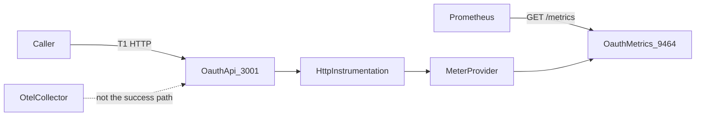
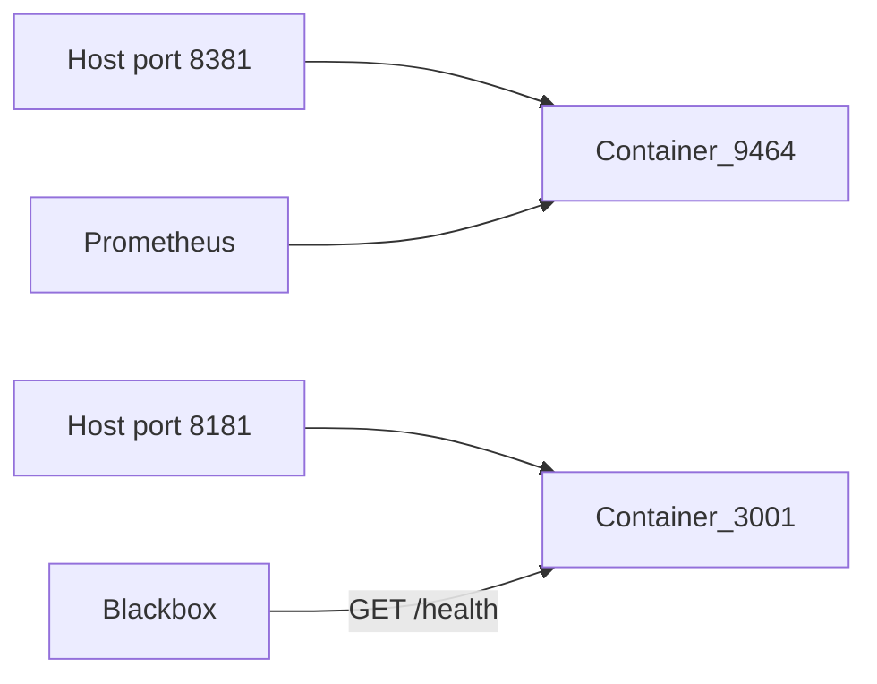

# Telemetry map

Prometheus scrapes the oauth metrics port. The API port stays the T1 HTTP server. The collector is not on the success path.

Invariants AD-1 through AD-7 live in the adopted spine `ARCHITECTURE-SPINE.md`.
